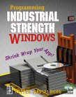

# textedit

TextEdit is a text editor, written in C++ to the raw Win32 API. It illustrates how to fit together all the myriad bits and pieces that make a robust Windows application a, well, robust Windows application.

TextEdit was originally written as the companion program to my book Programming Industrial Strength Windows (2000); I've occasionally fiddled with it in the years since then. It used to have a [home on CodePlex](https://textedit.codeplex.com/); it has now moved to GitHub. RIP, CodePlex.

## About TextEdit

TextEdit demonstrates a number of things:

* There is no _Save_ command. TextEdit follows Allan Cooper's unified file model, where all changes are committed directly to disk.
* Error handling and robustness.
* [Persistence everywhere](docs/Chapter-10-Customization-and-Persistence.md).
* Send as email.
* [Installation and registration](docs/Chapter-20-Setup-and-Down-Again.md) (under the hood, as it were).
* Utilizing the SendTo folder.
* [The myriad ways of starting a Windows app and receiving arguments](docs/Chapter-7-Off-the-Launch-Pad.md).
* [The fine points of dialogs](docs/Chapter-13-About-Dialogs.md)
* [Simple HTML parsing and rendering](docs/Sidebar-The-HTML-Static-Control.md).
* Snap window to edges of work area during move and resize.

## Documentation

I'm posting an entire book here, in the hope that this will provide sufficient documentation, and perhaps some additional value:

[Programming Industrial Strength Windows](docs/Programming-Industrial-Strength-Windows.md)

The logo was made with [Microsoft Expression Design 2.](http://www.microsoft.com/expression/products/Overview.aspx?key=design)

## Getting started

* [Install Visual Studio](https://www.visualstudio.com/downloads/)
* [Install WiX](http://wixtoolset.org/)
* Clone this project
