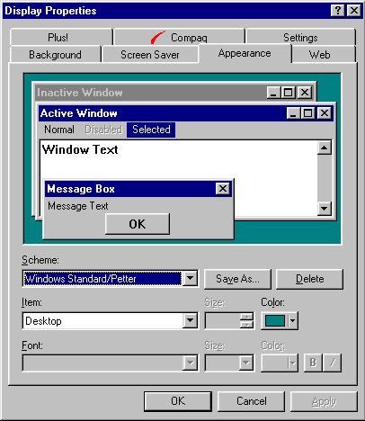
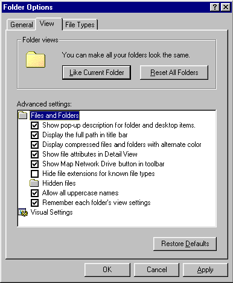

### Programming Industrial Strength Windows
[« Previous: The Main Window](Chapter-9-The-Main-Window.md) — [Next: Wait a Moment »](Chapter-11-Wait-a-Moment.md)
# Chapter 10: Customization and Persistence

Customization and persistence are closely linked. If J. Random Hacker’s customization settings aren’t preserved between sessions, she’ll lose interest very quickly.

This chapter discussed TextEdit customization, and how it uses the Windows registry to store persistent data. 

## Customizing Windows

Before we look at TextEdit-specific customization, let’s look at some of the things the user can do to customize Windows itself, and what the consequences are for us. I won’t go into things that don’t affect us – we don’t care if the user changes the desktop bitmap or the mouse pointer scheme, for example.

## Color Schemes and Window Metrics

Figure 12 shows the Appearance tab of the Display Control Panel applet. This dialog allows you to change colors, fonts and various metrics such as border widths.

**Figure 12: Customizing the Appearance of Windows.** Check out GetSystemMetrics and GetSysColor before deciding on colors, fonts and metrics for your application.

If the user changes the font for the active window title, we don’t have to do anything; this is handled behind the scenes. If, however, the user changes the menu font, it does matter, because TextEdit uses the menu font for the status bar.

Why? Among the standard schemes in Figure 12 are some with high contrast and large fonts. When Jane Random Hacker chooses such a scheme, it’s for a reason – perhaps her eyesight is weak, or perhaps she needs to see the monitor from the back of the room. If the status bar font remained small in the face of such a change, it would be invisible. Many applications, and, indeed, parts of Windows itself, don’t handle this well. The menu font may be 48 points, but everything else remains at eight points, unreadable to Jane. Even TextEdit is delinquent in this respect; the main window may be well behaved, but the dialogs don’t change. This afflicts all applications I’ve seen, and it may have something to do with the lack of any global default dialog font. One possibility might be to use the message font, which is customizable.

## Noticing the Changes

Clicking the OK button in Figure 12 may result in two different messages being broadcast: WM{"_"}SETTINGCHANGE and WM{"_"}SYSCOLORCHANGE. TextEdit has message handlers for these in mainwnd.cpp (as shown in Chapter 9).

The onSysColorChange function just passes the message on to all the child windows. They don’t all need it, but all the common controls do, including tool bars and status bars. Passing it to everybody is the simplest way of ensuring that those that need it get it.

The onSettingChange function is more complex. The language may have changed, fonts may have changed, even the thousands separator may have changed, which impacts the row/column display in the status bar.

## Retrieving the Font

The description of a UI font is stored in the registry as a blob. The menu font is stored under the following key:

{code:C#}
HKEY{"_"}CURRENT{"_"}USER\Control Panel\Desktop\WindowMetrics\MenuFont
{code:C#}
(BLOB is an acronym for a Binary Large OBject. Whether this blob deserves the adjective “large” is another matter.) This blob turns out to be a LOGFONT structure, and it can be used to instantiate a GDI object of the HFONT persuasion.

But, of course, there is no such thing as a LOGFONT structure. LOGFONT is a macro that evaluates to either LOGFONTA or LOGFONTW, depending on whether the preprocessor symbol UNICODE is defined. It turns out that the blob is a LOGFONTW under Windows NT. Under Windows 95, it’s a LOGFONTA – almost. The first five members of the LOGFONTA structure are defined as LONG in wingdi.h; in the Windows 95 registry blob, they are shorts, as defined in the LOGFONTWIN95REG structure in MenuFont.cpp. 

Standard APIs to retrieve the various UI fonts would be appreciated. This could be implemented by adding new parameters to GetStockObject, for example.

< Listing 40: MenuFont.h>
< Listing 41: MenuFont.cpp>

## Windows Explorer

The Windows Explorer, too, allows itself to be customized, and some of these customizations afflict – er, affect – TextEdit.

**Figure 13: Customizing the Windows Explorer.** Some of these settings are useful to applications; unfortunately, there aren’t always documented ways to retrieve them.

Figure 13 shows the View tab on the Explorer’s Option dialog. The list has two entries that TextEdit uses: 

# Display the full path in the title bar
# Hide file extensions for known file types

To get the file name to display in the title bar, TextEdit calls the GetWindowTitle function. This function takes care of the second point, but not the first. In fact, TextEdit never displays the full path in the title bar, as I’ve found no documented way of detecting this setting.

If you click the OK button in Figure 13, the Explorer broadcasts a WM{"_"}SETTINGCHANGE message The onSettingChange handler is simpleminded, and refreshes everything that might conceivably have changed.

## Regional Settings

The ramifications of the Regional Settings Control Panel applet will be explored in more depth in Chapter 18; I’ll just mention them here: TextEdit formats numbers and displays dates in the File Properties dialog, and measurements make an appearance in the Page Setup dialog.

## Customizing TextEdit

TextEdit doesn’t have a lot of explicit customization. You can hide or show the tool bar and status bars, and the View/Options dialog lets you change the proportional and fixed fonts. Then there’s the behavior on File Delete; this function may or may not display a dialog box. 

At this point, note one of the little conveniences that TextEdit offers: The Delete dialog can be turned off at the point where you are in the thick of things – in the Delete dialog itself. Note, also, that the Delete dialog tells you how to turn it back on, should you choose to turn it off. For obvious reasons, you can’t do this in the Delete dialog.

That’s all there is, on the application level. In addition, you can switch between the fixed and proportional fonts, you can toggle word wrapping, and you can change the number of spaces displayed per tab in the text. These settings are not purely global, though; they are handled per file type and, indeed, per individual file. I like to view my text files in a proportional font with word wrap on, while my program source files should display in a fixed font with word wrap off. No complex setuppery is required to achieve this; TextEdit simply remembers what I did last time, and does it the same way next time.

## Implicit Customization

For each individual file, TextEdit remember the position on the screen, and whether it was maximized. If you were editing the file when you closed Windows, TextEdit remembers this, too, and brings it back up when you restart Windows. If you had seven carefully aligned TextEdit windows on the screen when you closed Windows, you will have seven carefully aligned TextEdit windows on the screen when you restart Windows.

TextEdit remembers the position of dialog boxes. The first time you invoke a given dialog box, it will appear centered on the application (see the centerDialog function in winUtils.cpp). If you move the dialog, TextEdit remembers this, and will put it back where it was the next time you invoke it.

TextEdit remembers the content of dialog boxes. The Find dialog remembers previous search strings across invocations; the Delete dialog remembers whether it should send deleted files to the Recycle Bin.

Finally, there is the MRU (Most Recently Used) file list. This lets you open recently edited files at the click of a button; new files are added automatically.

In short, TextEdit has a memory. In the following, we’ll look at how this is implemented.

## Long-term Memory

TextEdit uses the Windows registry for its long-term memory. The structure of TextEdit’s registry entries is as follows:
{{
HKEY_CURRENT_USER\Software\Andersen Consulting\TextEdit\
  Delete\
    SendToWasteBasket:   REG_DWORD (bool)
    ShowDeleteDialog:    REG_DWORD (bool)
  File Types\
    Text Document\
      FixedFont:         REG_DWORD (bool)
      WordWrap:          REG_DWORD (bool)
    <more file types>\
      FixedFont:         REG_DWORD (bool)
      Tabs:              REG_DWORD (bool)
      WordWrap:          REG_DWORD (bool)
  Files\
    C:|AUTOEXEC.BAT\
      FixedFont:         REG_DWORD (bool)
      Height:            REG_DWORD (number)
      Left:              REG_DWORD (number)
      Running:           REG_DWORD (bool)
      Tabs:              REG_DWORD (bool)
      Top:               REG_DWORD (number)
      Width:             REG_DWORD (number)
      WindowState:       REG_DWORD (number)
      WordWrap:          REG_DWORD (bool)
    <more files>\
      FixedFont:         REG_DWORD (bool)
      Height:            REG_DWORD (number)
      Left:              REG_DWORD (number)
      Running:           REG_DWORD (bool)
      Tabs:              REG_DWORD (bool)
      Top:               REG_DWORD (number)
      Width:             REG_DWORD (number)
      WindowState:       REG_DWORD (number)
      WordWrap:          REG_DWORD (bool)
  Fonts\
    FixedCharSet:        REG_DWORD (number)
    FixedFace:           REG_SZ  (string)
    FixedHeight:         REG_DWORD (number)
    FixedItalic:         REG_DWORD (bool)
    FixedWeight:         REG_DWORD (number)
    ProportionalCharSet: REG_DWORD (number)
    ProportionalFace:    REG_SZ  (string)
    ProportionalHeight:  REG_DWORD (number)
    ProportionalItalic:  REG_DWORD (bool)
    ProportionalWeight:  REG_DWORD (number)
  MRU\
    FileName0:           REG_SZ  (string)
    FileName1:           REG_SZ  (string)
    ...
    FileName19:          REG_SZ  (string)
  Open\
    CustomFilter:        REG_SZ  (string)
    FilterIndex:         REG_DWORD (number)
  Printer\
    BottomMargin:        REG_DWORD (number)
    Device:              REG_SZ  (string)
    Driver:              REG_SZ  (string)
    LeftMargin:          REG_DWORD (number)
    Orientation:         REG_DWORD (number)
    Paper:               REG_DWORD (number)
    Port:                REG_SZ  (string)
    RightMargin:         REG_DWORD (number)
    TopMargin:           REG_DWORD (number)
  Replace\
    Pattern0:            REG_SZ  (string)
    Pattern1:            REG_SZ  (string)
    ...
    Pattern9:            REG_SZ  (string)
  Search\
    Backwards:           REG_DWORD (bool)
    MatchCase:           REG_DWORD (bool)
    MatchWholeWord:      REG_DWORD (bool)
    Pattern0:            REG_SZ  (string)
    Pattern1:            REG_SZ  (string)
    ...
    Pattern9:            REG_SZ  (string)
}}
A vertical bar replaces each backslash in the file name keys. This is a simple textual substitution to avoid conflict with the use of the backslash in registry key names.

This may seem like a large amount of complex information to shuffle in and out of the registry. As we shall see, it is actually quite simple to use.

## The Registry Interface

TextEdit’s interface to the Windows registry is layered as follows: 

# At the bottom, we have the Windows registry API, which is quite low-level and cumbersome to use. 
# The Registry class encapsulates the registry API, and is a lot more convenient to use. The Registry class doesn’t know the meaning of the data it shuffles around.
# The file persistence.h defines a set of macros for defining “persistent variables.” Instead of having a global variable named FilterIndex, you get a pair of functions, getFilterIndex and setFilterIndex. (Similar macros exist in the Document class, allowing document-local persistence, e.g., whether a specific file was maximized the last time it was open.)
# Finally, we’re getting to the functional layer, which has application-level meaning. Using the macros in persistence.h, we can define persistent variables galore. 

Using this scheme has one great advantage over the more common method of saving all persistent information at the end of a session: If TextEdit crashes, changes to the settings are nevertheless retained.

Let’s go back to level two for a moment, and look at the Registry class. This is a wrapper for a set of static functions; you can’t instantiate a Registry object. In addition to being a high-level interface to the registry API, the Registry class performs one additional service: It decorates the key names so that we end up in the right sub-tree in the registry. Thus, "Search" becomes:
{{
"Software\Andersen Consulting\TextEdit\Search"
}}
Sometimes, though, we need to access information elsewhere in the registry. The following strings are recognized; if either is present, the key is retained as is:

{code:C#}
#define WIN_SETTINGS _T( "Microsoft\\Windows\\CurrentVersion" )
#define CPL_SETTINGS _T( "Control Panel\\Desktop\\WindowMetrics" ) 
{code:C#}

< Listing 42: Registry.h>
< Listing 43: Registry.cpp>

## Persistent Variables

Let’s study one of the macros in persistence.h, DEFINE{"_"}PERSISTENT{"_"}BOOL, to see how it works:

{code:C#}
#define DEFINE_PERSISTENT_BOOL( section, name )        \
   inline bool get ## name( void ) {                   \
      return 0 != Registry::getInt( HKEY_CURRENT_USER, \
         _T( section ), _T( #name ), 0 );              \
   };                                                  \
   inline void set ## name( bool bValue ) {            \
      Registry::setInt( HKEY_CURRENT_USER,             \
         _T( section ), _T( #name ), bValue );         \
   }
{code:C#}
One use of the macro is this:

{code:C#}
DEFINE_PERSISTENT_BOOL( "Search", MatchCase );
{code:C#}
This expands to:

{code:C#}
   inline bool getMatchCase( void ) {
      return 0 != Registry::getInt( HKEY_CURRENT_USER,
         _T( "Search" ), _T( MatchCase ), 0 ); 
   };
   inline void setMatchCase( bool bValue ) {
      Registry::setInt( HKEY_CURRENT_USER, 
         _T( "Search" ), _T( MatchCase ), bValue );
   }
{code:C#}
The macros for integers and strings are similar in structure. One deserves special mention: DEFINE{"_"}PERSISTENT{"_"}STRING{"_"}EX allows indexed persistent variables. After the declaration of 

{code:C#}
DEFINE_PERSISTENT_STRING_EX( "Search", Pattern );
{code:C#}
I can write

{code:C#}
setPattern( 1, _T( "someString" );
{code:C#}
and end up with the following registry entry:
{{
Software\Andersen Consulting\TextEdit\Search\Pattern1=someString
}}
Most of the persistent variables are used across several modules, and therefore defined in persistence.h. Those that are used only by a single module are defined in that module, to reduce visibility.

Macros such as DEFINE{"_"}PERSISTENT{"_"}BOOL make it easy to define persistent variables – imagine coding all those getters and setters by hand! The down side is that the code is difficult to debug because multiple code lines are compressed into a single source line. You should always start with a hand-coded function, and only start using the code-generating macros when that function is fully debugged. 

If I had created this module from scratch today, I would have sidestepped the debugging problem by replacing the macros with templates.

< Listing 44: persistence.h>

Document Local Persistence

As an example of how document-local persistence works, consider how TextEdit initializes word wrapping when you load the file C:\Data\test.txt:

# Start with the system default value, which for word wrapping is zero.
# Check the file type of C:\Data\test.txt, and determine that this file is of type Text Document.
# If the registry entry Software\Andersen Consulting\TextEdit\File Types\Text Document\WordWrap exists, use its value; otherwise keep the current one.
# If the registry entry Software\Andersen Consulting\TextEdit\Files\C:|Data|test.txt\WordWrap exists, use its value; otherwise keep the current one.

If you change the word wrapping while editing C:\Data\test.txt, both these registry entries will be updated, and the new value will apply to new files of type Text Document, as well as any such file that doesn’t have an explicit word wrap setting. It gets an explicit setting only if you change the setting while editing the file.

Document local persistence is implemented through macros defined in Document.h. Actually, there’s only one such macro, since all the values happen to be numbers:

{code:C#}
#define DEFINE_PERSISTENT_DOC_INT( name, type )               \
   inline int get ## name( int nDefault ) const {             \
      return getPersistentInt( _T( #name ), nDefault, type ); \
   };                                                         \
   inline void set ## name( int nValue ) {                    \
      setPersistentInt( _T( #name ), nValue, type );          \
   }
{code:C#}
This macro is similar to those defined in persistence.h, except that, instead of calling the getter and setter functions in the Registry class, they call a couple of Document methods that wrap those defined in the Registry class. These wrapper methods do two things: They add the file name to the key (converting backslashes to vertical bars in the process), and they handle everything to do with the file type settings. If the type parameter is true, information is saved for file types as well as for individual files. If the type parameter is false, information is only saved for individual files. Examples: Fixed or proportional font is saved for both file types and individual files, while window position is only saved for individual files.

Since the macro generates code to call Document methods, it follows that the macro must be used inside the declaration of the Document class. A corollary is that the generated functions are themselves Document methods.

## MRU

MRU means Most Recently Used. The MRU file list is implemented by the MRU class. In addition to managing a persistent file list in the registry, the MRU class also interfaces to the system-wide MRU file list, the one found under Documents in the Start Menu. You add files to this list by calling the SHAddToRecentDocs function.

< Listing 45: MRU.h>
< Listing 46: MRU.cpp>

## Data Sharing Across Instances

The registry is global, and its contents are shared across all running instances of TextEdit. It follows that they all have the same MRU file list at all times, and that the contents of the Find dialog drop-down is shared, and that printer settings made in one instance are immediately reflected in other instances. (The only exception is if the dialog in question is active in the other TextEdit instance.)

Font changes are not reflected in concurrently running TextEdit instances. Again we see the difference between things that are initialized at specific times, such as when a menu drops down or a dialog box pops up, and things that are always visible in the user interface, such as toolbar icons and the current font. With a few well-chosen inter-instance notification messages, it would be relatively easy to reflect font changes immediately, and even to update the contents of active dialog boxes. If we were to take such a policy to its logical conclusion, we should replace the “one option dialog per instance” paradigm with something like the Windows Control Panel – one common dialog for all running instances.

To share or not to share, that is the question. Perhaps it would’ve been better to let each file store its own printer settings, for example. On the other hand, it is reassuring for the user to think of the printer as one object that behaves the same for all instances; if you change it, it stays changed. I just want to point out that such questions bear thinking about; I’m sorry to say that I seem to have mislaid the right answer.

## RunOnce

So far, we’ve discussed TextEdit’s use of the registry for persistent storage of user information. TextEdit also uses the registry to store setup information; this is discussed in Chapter 20. In this section, we’ll look at how TextEdit instances are persistent across logoff and shutdown.

Windows knows about this registry key:
{{
HKEY_CURRENT_USER\Software\Microsoft\Windows\CurrentVersion\RunOnce
}}
Whenever Windows starts, it enumerates all key-value pairs under this key, and executes all the values as commands. The Windows Explorer uses this feature to restore all the Explorer windows.

A naïve (and all too common) use of this facility is to insert a RunOnce command in response to the WM{"_"}ENDSESSION message, e.g.:

{code:C#}
HKEY_CURRENT_USER\Software\Microsoft\Windows\CurrentVersion\RunOnce\
   TextEdit="C:\Program Files\TextEdit\TextEdit.exe C:\Data\test.txt"
{code:C#}
This approach has at least two problems: 

# If the system goes down catastrophically, we never see the WM{"_"}ENDSESSION message, and restart doesn’t take place. 
# If multiple instances of TextEdit were running, they would have to ensure that each had a unique name. This is possible, of course, but it is certainly extra work.

What TextEdit actually does is the following: When TextEdit starts, it inserts the following under the RunOnce key:

{{TextEdit Restart="C:\Program Files\TextEdit\TextEdit.exe /boot"}}

It is not a problem if this overwrites an existing entry, as all entries are equal. The code to do this is located in init.cpp, and looks like this:

{code:C#}
LOCAL void initReboot( void ) {

   const String strProgram = getModuleFileName();
   Registry::setString( HKEY_CURRENT_USER,
      RUNONCE_PATH, _T( "TextEdit Restart" ),
      _T( "%1 /boot" ), strProgram.c_str() );
}
{code:C#}
The constant RUNONCE{"_"}PATH is defined in setup.h, as follows:

{code:C#}
#define WIN_PATH _T( "Software\\Microsoft\\Windows\\CurrentVersion" )
#define RUNONCE_PATH   WIN_PATH _T( "\\RunOnce" )
{code:C#}
Next, the document local persistent variable Running is set to one. If TextEdit exits in response to WM{"_"}ENDSESSION, it remains one; otherwise, it’s reset to zero. If Windows crashes, the value of Running remains 1, and restart will take place.

When TextEdit is started with the /boot option, it does the following:

# It iterates over all the TextEdit files in the registry and invokes TextEdit anew for any files with Running=1. 
# It purges the registry file list of any files that are no longer in the MRU list. If we didn’t do this occasionally, the registry would fill up. Note, though, that the MRU list contains more files than are shown in the File menu, so settings for an individual file last for a while after the file falls off the edge of the MRU menu.

Then it exits. Windows removes all RunOnce entries after executing them. If you don’t start any new TextEdit instances this Windows session, no new reboot entry will be added, and there will be no restart.

The WM{"_"}QUERYENDSESSION/WM{"_"}ENDSESSION message pair have different behaviors under Windows 9x and Windows NT. Under Windows 9x, after each application responds with TRUE to the WM{"_"}QUERYENDSESSION message, they receive the WM{"_"}ENDSESSION message and are terminated. Under Windows NT, if you reply TRUE to WM{"_"}QUERYENDSESSION, you immediately receive WM{"_"}ENDSESSION and are terminated, even though other applications may still respond with FALSE to WM{"_"}QUERYENDSESSION. 

I’ve tried to come up with good adjectives to describe this state of affairs (e.g., “weird,” “ridiculous”), but they all strike me as understatements. I’ll leave it as an exercise for the adjectivally inclined reader.

< Listing 47: reboot.cpp>

## Food for Persistent Thought

Persistence as such is a Good Thing. Whether the TextEdit approach to persistence is correct in all cases is another matter. Issues to consider include:

* What should you store?
* Where should you store it?
* Which information should you store per user?
* Which information should you store per file?
* Does the information ever expire?

If you control the file format yourself, per-file information belongs in the file itself. The Microsoft Office products do this, and for any file format based on OLE structured storage, inserting additional streams would seem a reasonable option. Some standardized file formats also allows for this kind of thing – the Tagged Image File Format (TIFF), for example, is extensible, and allows you to store anything you like in the same file as the image(s). Other TIFF readers will simply ignore your private tags; unfortunately, other TIFF editors will most likely obliterate them.

TextEdit deals with plain text files. This is the most general file format imaginable, with no internal structure at all except line breaks. Storing per-file information as part of the text stream is out of the question. There is another possibility, though, in file systems that support extended attributes or contents of some sort. The NTFS file system, for example, supports named streams in addition to the unnamed default stream (what you’d normally think of as the file’s contents). It’s an attractive option to use named streams to store window positions, older versions, change log, and so forth. Care must be taken to preserve such information when saving files; this is discussed briefly in the “Saving” section of Chapter 12.

TextEdit must work even with the FAT file system, which means that per-file information must be stored outside the document file. Again, the possibilities are many – flat files, INI files, databases – anything you like, really. The major advantage of using the registry is that we can easily store both common and per-user information. The major disadvantage is that we cannot store anything we like in the registry. Storing backup copies of a file’s contents would be a bad idea, for example; TextEdit handles files up to 2GB, and stuffing megabyte upon megabyte into the registry wouldn’t do it any good. The registry is not a database, and best suited to relatively small, controlled amounts of information.

Per-file information can be stored in another file, alongside the document file. This is more visible to the end user than I like, and, if the per-file information includes older versions, creates problems on floppies. If you save both the file and its backup on the same disk, the useful capacity is halved. If you do supply versioning support, it is probably wise to give the user some control over it, as the impact on disk space may be significant.

If you’re going to store per-application information on disk, create an application-specific directory under the directory that getSpecialFolderLocation( CSIDL{"_"}APPDATA ) would retrieve. If TextEdit used this approach, application data might be stored in this location:
{{
C:\WINNT\Profiles\<username>\Application Data\TextEdit
}}
TextEdit stores information about individual files for as long as they remain in the extended MRU list. Other possibilities include setting a time limit on that kind of meta-information, or using a combination of the two. 

These few paragraphs just scratch the surface of the persistence question. They don’t provide a full answer, but I hope they encourage you to think carefully about persistence.
