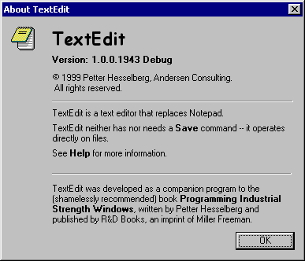
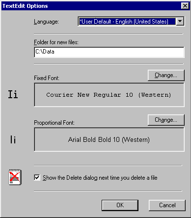

### Programming Industrial Strength Windows

[« Previous: File I/O](Chapter-12-File-I-O.md) — [Next: File Management »](Chapter-14-File-Management.md)

# Chapter&nbsp;13: About Dialogs

The logical continuation of the TextEdit story is really Chapter&nbsp;13, File Management. That subject, however, involves dialog boxes. Let’s ease into the subject of dialog boxes through some easy ones, such as the About dialog and the Options dialog (and defer file management to [Chapter&nbsp;14](Chapter-14-File-Management.md)).

## What is a Dialog Box, Anyway?

Everybody knows what a dialog box is, sort of. But what is it, really? Exactly what is it that makes a dialog box differ from other windows?

Dialog template resources are closely linked with Windows dialog box functions. Note, though, that the template may be constructed in memory – there’s no rule that says it must come from a file. You can even sidestep the whole template by using CreateWindow or CreateWindowEx to add controls programmatically. Once a dialog is constructed, there’s no way to get a reference to the original template. If there was one.

The key attributes of dialog boxes are supplied by the DefDlgProc and IsDialogMessage functions, in conjunction with the controls themselves. DefDlgProc is the window function for the predefined dialog box window class. If you supply your own class, you should pass unhandled messages to DefDlgProc rather than DefWindowProc. You must also ensure that the class defines at least DLGWINDOWEXTRA window bytes. The IsDialogMessage function supplies the keyboard interface. For modeless dialog boxes, you must call this function in your own message pump. Modal dialog boxes have their own message pump hidden in the murky depths of the DialogBox function, so you don’t have to worry about it.

The dialog box keyboard interface carries out special processing for several keys. It allows you to navigate the input focus between the controls in the dialog, and to generate messages corresponding to certain buttons. The following table is copied from Microsoft’s online documentation; it merits careful study:

| Key | Action |
|-----|--------|
| Alt+mnemonic | Moves the input focus to the first control (having the WS_TABSTOP style) after the static control containing the given mnemonic. |
| Down | Moves the input focus to the next control in the group. |
| Enter |Sends a WM_COMMAND message to the dialog box function. The wParam parameter is set to IDOK or control identifier of the default push button. |
| Esc |Sends a WM_COMMAND message to the dialog box function. The wParam parameter is set to IDCANCEL. |
| Left | Moves the input focus to the previous control in the group. |
| Mnemonic | Moves the input focus to the first control (having the WS_TABSTOP style) after the static control containing the given mnemonic. |
| Right | Moves the input focus to the next control in the group. |
| Shift+tab | Moves the input focus to the previous control that has the WS_TABSTOP style. |
| Tab | Moves the input focus to the next control that has the WS_TABSTOP style. |
| Up | Moves the input focus to the previous control in the group. |

Note in particular what this table says about the Enter and Escape keys: They send IDOK and IDCANCEL commands, respectively, but there is no requirement that controls with IDOK or IDCANCEL IDs exist.

Controls – windows that are meant to be children of dialog windows – must fulfill certain criteria to be good dialog citizens. They should understand window styles such as WS_TABSTOP and they should respond intelligently to message such as WM_GETDLGCODE. If they have a keyboard interface, they should provide a visible indication of keyboard focus.

## The Dialog class

The Dialog class is a dialog-wrapping subclass of the Window class described in Chapter&nbsp;4. But a dialog function is not the same as a window function. DefDlgProc is the default window function for dialogs; DefDlgProc, in turn, calls the user-defined dialog function (if and when it feels like it). The dialog function returns a BOOL rather than an LRESULT; the DlgProc and dispatchDlgMsg virtual methods are in charge of this.

To handle dialog commands, you should override onDlgCommand rather than onCommand. The first is called from the dialog function, while the latter is called from the window function. Given that the Dialog class subclasses DefDlgProc by virtue of being a Window, you can override anything you like, of course, but do keep this difference in mind.

The doModal method wraps the call to DialogBoxParam. A pointer to the Dialog object is passed as the lParam; this is used in DlgProc to attach the HWND to the Dialog object.

If a dialog box blows up, the parent window may remain disabled even though the dialog is gone, with no way to re-enable it. To avoid this, the doModal method has an “emergency aid station” that catches all exceptions and enables the parent.

## Positioning the Dialog

The positioning of a dialog is a somewhat tortuous process. When dispatchDlgMsg handles the WM_INITDIALOG message, it starts by centering the dialog in relation to the TextEdit window. (The DS_CENTER window style, by the way, would center the dialog in the screen’s working area, which is not what I want.) This is the default position for any TextEdit dialog. But consider – if our old friend Jane ever moves a dialog, it’s because she thinks it looks better in the new spot. Wouldn’t it be nice if TextEdit could remember this, and, the next time the dialog is invoked, place it in the same spot?

TextEdit dialog positions are persistent, although only within a single session. Positioning is handled by a pair of functions defined in winUtils.cpp, along with the static variable thePointMap:

```C++
typedef std::map< int, Point > PointMap;
PRIVATE PointMap thePointMap;

void savePosition( HWND hwnd, int id ) {
   Rect rc = getWindowRectInParent( hwnd );
   thePointMap[ id ] = Point( rc.left, rc.top );
}

void restorePosition( HWND hwnd, int id ) {
   centerDialog( hwnd );
   PointMap::iterator iter = thePointMap.find( id );
   if ( thePointMap.end() != iter) {
      MapWindowPoints(
         GetParent( hwnd ), HWND_DESKTOP, &iter->second, 1 );
      moveWindow( hwnd, iter->second.x, iter->second.y );
   }
   adjustToScreen( hwnd );
}
```

Note the call to MapWindowPoints, which ensures that the position of the dialog is remembered in relation to the application window rather than in relation to the screen.

If the id parameter doesn’t appear in the map, the user is invoking the dialog for the first time, and no repositioning is done. (Remember that the dialog has already been centered on the application window.) If the id parameter does appear in the map, the dialog is moved to the remembered position. Finally, the position is adjusted (if necessary) so that the dialog is inside the work area of the screen.

Where, then, does this id parameter come from? The dialog certainly can’t tell you whence it came. Although most dialogs are created from dialog resources, and thus have IDs, you can’t get this information from the dialog’s hwnd. The purpose of getResourceID() virtual method is to retrieve the ID, which is hard-coded into the class definition. It is impossible to retain the position of dialogs not wrapped by the Dialog class.

[Dialog.h](../src/Dialog.h)\
[Dialog.cpp](../src/Dialog.cpp)

## The About Box

The “About TextEdit” dialog box is about as simple as they come. The only complications are hidden in the setFonts and setInfo methods of the AboutDlg class; both are called from the onInitDialog method. In setFonts, note that the size of the new fonts is always relative to the original size, and that you must take the size changing into account when constructing the dialog template by making sure the affected controls have enough room. The setInfo method uses the VersionInfo class to retrieve version information from the program. This class is independent of the TextEdit architecture, making it easy to reuse in other projects.

The only possible interaction is to dismiss the dialog, which is why I call it simple in spite of the rather extensive initialization.



**Figure&nbsp;15: The About Dialog.** Some STATIC widgets have been subjected to a WM_SETFONT message, while others have been subclassed.

If you look at the dialog box in Figure&nbsp;15, you’ll note several different fonts. In the case of the program title and version, this is a simple matter of creating the desired font, then sending a WM_SETFONT message to the control. This is done using the SetWindowFont macro defined in windowsx.h.

More interesting is the boldfacing of individual words in the IDC_COMMENTS and IDC_COMMERCIAL controls. This is done by subclassing normal static controls. In onInitDialog, you’ll find a pair of calls to subclassHTML, which is all it takes to accomplish this. Except, of course, for writing the subclassHTML function itself, and accompanying paraphernalia. This is described in the sidebar entitled “[The HTML Static Control](Sidebar-The-HTML-Static-Control.md).”

[AboutDlg.cpp](../src/AboutDlg.cpp)\
[HTML.h](../src/HTML.h)\
[HTML.cpp](../src/HTML.cpp)

## The Options Dialog

The Options dialog box looks like this:



**Figure&nbsp;16: The Options Dialog.** The icons on the left are illustrative only; they do not reflect state in any way.

It is a little bit more complex, interaction-wise, than the About dialog. AboutDlg can get along with just the default onDlgCommand method defined in the Dialog base class, whereas OptionsDlg needs its own:

```C++
void OptionsDlg::onDlgCommand(
   int id, HWND hwndCtl, UINT codeNotify )
{
   switch ( id ) {
   case IDC_CHANGE_FIXED_FONT:
      if ( BN_CLICKED == codeNotify ) {
         changeFont( getDlgItem( IDC_FIXED_FONT_SAMPLE ),
            &m_logFontFixed, &m_hfontFixed, CF_FIXEDPITCHONLY );
      }
      break;

   case IDC_CHANGE_PROPORTIONAL_FONT:
      if ( BN_CLICKED == codeNotify ) {
         changeFont( getDlgItem( IDC_PROPORTIONAL_FONT_SAMPLE ),
            &m_logFontProportional, &m_hfontProportional );
      }
      break;

   case IDOK:
   case IDCANCEL:
      exitLanguageComboBox( *this );
      setShowDeleteDialog(
         0 != Button_GetCheck( getDlgItem( IDC_SHOWDELETEDIALOG ) ) );
      setDocumentPath( getDlgItemText( IDC_DOC_PATH ).c_str() );
      verify( EndDialog( *this, id ) );
      break;
   }
}
```

## Enter with Care

The BUTTON window class supports a style bit named BS_DEFPUSHBUTTON. This draws the button with a heavy black border, indicating that it is the default button, and that you can activate it by pressing the Enter key.

The black border is just a visual clue; the functional aspects of the default button come from the dialog window class and the IsDialogMessage function. The dialog box has its own concept of a default button, which you can set using the DM_SETDEFID message. When a dialog receives this message, it may send WM_GETDLGCODE and BM_SETSTYLE to the indicated button as well as to the current default button.

This is less straightforward than it sounds. In particular, problems abound whenever you dynamically enable and disable buttons, or when you change the default button. Consider this code fragment from the onDlgCommand method of PropertiesDlg (described in Chapter&nbsp;14):

```C++
switch ( id ) {
...
case IDC_APPLY:
   if ( BN_CLICKED == codeNotify ) {
   ...
      if ( applyChanges() ) {
         setDlgItemText( IDCANCEL, loadString( IDS_CLOSE ) );
         if ( GetFocus() == getDlgItem( IDC_APPLY ) ) {
            assert( IsWindowEnabled( getDlgItem( IDOK ) ) );
            gotoDlgItem( IDOK );
         }
         enableDlgItem( IDC_APPLY, false );
      }
   }
   break;
}
```

What happens if we disable the IDC_APPLY button, but omit the gotoDlgItem( IDOK ) line? We lose the keyboard interface, that’s what, and all keys simply go beep in the night. Furthermore, the Property dialog’s Apply button retains its default border, even when disabled.

One of the possible flag parameters to the MessageBox function is MB_NOFOCUS, which ensures that no button has the initial focus. This is useful if you want to protect the MessageBox against accidental dismissal. To create a really obnoxious dialog box, let it respond to all WM_COMMAND messages with SetFocus( 0 ).

The most complex examples of dialog interaction that TextEdit has to offer are the Find and Replace dialogs, described in [Chapter&nbsp;15](Chapter-15-Search-and-Replace.md).

[Sidebar: Default Buttons and Multi-line Edit](Sidebar-Default-Buttons-and-Multi-line-Edit.md)
