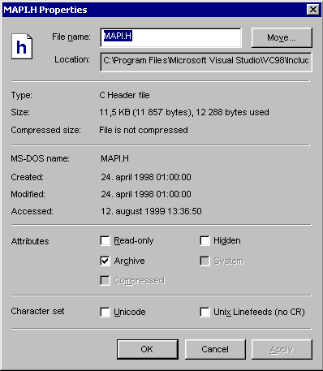
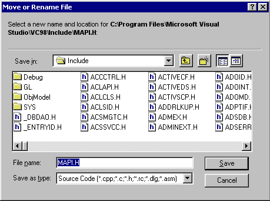
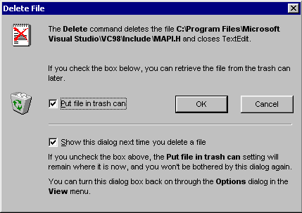
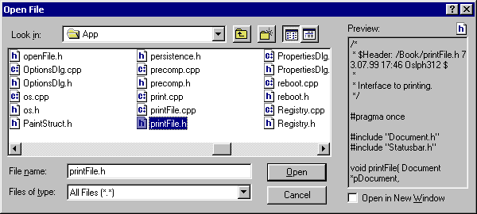
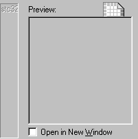

### Programming Industrial Strength Windows
[« Previous: File Management](Chapter-13-About-Dialogs.md) — [Next: Search and Replace »](Chapter-15-Search-and-Replace.md)
# Chapter 14: File Management

File management in the context of TextEdit is the management of a single file. It includes the ability to change file attributes such as the read-only flag, it includes renaming and repositioning of the file, and it includes deleting the file (and, incidentally, closing TextEdit).

Some file management functionality – toggling the read-only attribute – is exposed in the main window. For the rest, the Properties and Delete dialogs (PropertiesDlg.cpp and DeleteDlg.cpp) do the job, together with the openFile function and the saveFile function (which is accessible from the File menu as well as from the Properties dialog’s Move button).

TextEdit also manages properties such as “Unicode.” TextEdit detects whether a file is Unicode when it loads the file; changing this property determines how the file will be saved. The same holds true for the different ways of dividing the text file into lines: CR-LF or just LF.

## File Properties

The Properties dialog displays information about the currently loaded file: File name, location, file type, file size, time stamps, file attributes, Unicode and line separators. The layout of this dialog is similar to the Windows Explorer’s Properties dialog (see Figure 17).



**Figure 17: The Properties Dialog.** It is similar to the Exlorer’s corresponding dialog.

The dialog lets you change some of the attributes displayed in the dialog. You can change the file name on the fly, by typing a different name in the File Name field. To move the file to a different location, you must press the Move buttons to invoke a second dialog box (Figure 18); the Location field is read-only. This offloads everything to do with directories onto a common dialog designed for the purpose, and avoids issues of how to handle non-existent directories, invalid path names and so forth. A better solution would be one that allowed both approaches.



**Figure 18: Move or Rename File Dialog.** This is really a Save As dialog, with extra information on the top.

The Move/Rename dialog allows you to change the file name as well as the file location – it’s a “Save As…” dialog. The same dialog is available directly from the File menu (for improved visibility), and a variation is used in Document::save: if TextEdit is unable to write to the original file, it uses this dialog to get a new name and location (see Chapter 12).

You can change the file attributes Read Only, Hidden, Archive and Compressed; the System attribute is read-only. I followed Windows Explorer’s lead in this; presumably, Microsoft’s designers felt that the average user shouldn’t mess with such things. Maybe so.

The Compressed attribute is different from the others: A “traditional” file attribute is just a flag in the file’s directory entry, to be set or cleared using SetFileAttributes (see modifyAttribs in fileUtils.cpp). Compression, on the other hand, actually mangles the file’s contents. To compress or uncompress a file, you must use the DeviceIoControl function (see compressFile in fileUtils.cpp). 

Compression of individual files is not supported on all file systems. In particular, it is not supported on FAT volumes. The Compressed check box should be enabled only if the underlying file system supports compression; this can be determined by the GetVolumeInformation function (see supportsCompression in fileUtils.cpp).

The Unicode and CR/LF “attributes” are even more different from the others, as they aren’t properties of the file system at all, but functions of the file’s contents. Changing these quasi-properties set or clear appropriate flags in the Document class; these flags determine how the file is saved.

The Properties dialog does not apply any changes until you click the Apply button or the OK button. Both of these invoke the applyChanges method in PropertiesDlg. In addition to applying changes, this method forwards an ID_COMMAND_PROPSCHANGED command to the parent window, which allows the main window to change whatever UI elements need changing – the file name displayed in the window title, read-only status and so forth. 

If you can’t change a file’s properties – if it’s on a CD-ROM or a write-protected floppy, or if you don’t have write access – everything except the Cancel button is disabled by the onInitDialog method.

< Listing 58: PropertiesDlg.h >
< Listing 59: PropertiesDlg.cpp >

## Deleting Files

TextEdit’s Delete command deletes the current file. Since the unified file model requires a file in order for TextEdit to run, the command closes TextEdit as well.

The Delete command may or may not open the confirmation dialog shown in Figure 19. The ShowDeleteDialog registry variable defined in persistence.h controls this. The user, in turn, controls the registry variable. You can turn it off by unchecking the lower checkbox in Figure 19 (the one labeled “Show this dialog the next time you delete a file”). For obvious reasons, you can’t turn it back on using the same checkbox. To prevent the user from getting lost, the dialog explains how you can turn it back on. (Note how the functional part of the “confirm file delete” confirmation dialog stops at the horizontal line – what’s below is concerned with management of the dialog itself, and has nothing to do with deleting files.)



**Figure 19: The Delete File Dialog.** The upper icon is static and helps identify the dialog; the trash can icon is dynamic and changes according to the setting of its corresponding checkbox.

A menu command should have a trailing ellipsis if it invokes a dialog box; otherwise not. The onInitMenu message handler (in mainwnd.h) handles this by altering the menu text depending on the setting of ShowDeleteDialog, as follows:

```C++
String strDeleteFile = getMenuItemText( hmenu, ID_FILE_DELETE );
int iDotPos = strDeleteFile.find( _T( '.' ) );
if ( 0 <= iDotPos ) {
   strDeleteFile.erase( iDotPos );
}
if ( getShowDeleteDialog() ) {
   strDeleteFile.append( _T( "..." ) );
}
setMenuItemText( hmenu, ID_FILE_DELETE, _T( "%1" ), strDeleteFile.c_str() );
```

This code fragment checks to see if an ellipsis is present; if so, the ellipsis is removed. If the dialog is to be shown, the ellipsis is appended again. That way, it doesn’t matter whether the original menu string contained an ellipsis.

Document::deleteFile physically deletes the file, and removes the file name from the MRU list as well (see Listing 52 in Chapter 12). It does not use the DeleteFile function, but relies instead on SHFileOperation. This lets us send the file to the trash can, if the user so desires, just by specifying the FOF_ALLOWUNDO flag. Furthermore, SHFileOperation takes care of the additional confirmation dialog, if any – it follows the user’s Explorer settings.

One of the parameters to SHFileOperation is a pointer to an SHFILEOPSTRUCT. The pFrom member of this structure is actually a list of null-terminated file names; the list itself must be doubly null-terminated. (This is an error-prone approach to an API – it did burn me, at least. QED.)

The trash can icon in Figure 19 is really two icons – one icon showing a full trash can, another icon showing an empty one. Only one of them is visible at a time, though; this is toggled whenever the user checks or unchecks the “Put file in trash can” checkbox:

```C++
toggleIcon( IDC_WASTEBASKET, IDC_WASTEBASKETEMPTY, 0 != Button_GetCheck( getDlgItem( IDC_TRASHCAN ) ) );
```

The icon serves as a visual reinforcement of the setting of the checkbox. In addition to being pretty cool, this is actually useful. The Find dialog uses the same technique.

< Listing 60: DeleteDlg.h >
< Listing 61: DeleteDlg.cpp >

## The Open File Dialog

The Open File and Save File common dialogs are little Explorers in their own right. Figure 20 shows TextEdit’s Open File dialog in action. As you can see, it has four extra controls – one static label, one edit control used to show a preview of the selected file, one icon to show the type of the selected file and one checkbox that lets you open the file in a new window.



**Figure 20: The Open File Dialog.** The extra controls on the right come from the dialog template IDD_PREVIEW_CHILD.

You change the look of most common dialogs by specifying a resource template that replaces the default dialog. The Open and Save dialogs are exceptions; you specify, instead, the template of a child dialog that is added to the system-supplied dialog. The template must have the WS_CHILD style bit set, and it should include a static control with the ID stc32. This is a placeholder for the system-supplied dialog, and tells GetOpenFileName and GetSaveFileName how to place the child dialog in relation to predefined controls. Figure 21 shows the child dialog (IDD_PREVIEW_CHILD); its relationship to Figure 20 should be clear. 



**Figure 21: The Open File Child Dialog.** The STATIC control labeled stc32 is a placeholder for the standard contents of the Open File dialog.

[Sidebar: The Open File Common Dialog Bug](Sidebar-The-Open-File-Common-Dialog-Bug.md)

## Filter Strings

The file openDlgCommon.cpp defines everything the Open and Save dialogs have in common. Aside from fixing the problem described in the sidebar “Open File Common Dialog Bug,” the code here is mostly concerned with handling filter strings – the strings that go into the combo box labeled “File Type” in Figure 20. As we shall see, this is a rather convoluted business.

The lpstrFilter member of the OPENFILENAME structure points to a string defining the predefined filter entries. (“Predefined?” I hear you ask. Well, there is a member named lpstrCustomFilter as well, which I’ll get back to in a moment.) Each combo box entry is defined by two strings – the text that appears in the drop-down list, and the corresponding wildcard pattern. Each of these sub-strings is null-terminated. For example: 

{{   Batch Files\0**.bat;**.cmd\0}}

To get multiple entries, you just string several of these together, e.g.:

{{   Batch Files\0**.bat;**.cmd\0All Files\0**.**\0}}

A final null terminates the whole assemblage, so that there are two nulls at the end.

There is a problem with this: The filter strings are stored in a string table resource (IDS_FILEFILTERS), so that the UI texts may be translated without recompiling the program. Since the null terminator is just that, a terminator, handling strings with embedded nulls is inconvenient. To get around this, the text in the string table uses vertical bars rather than nulls; part of the IDS_FILEFILTERS string table entry looks like this:

{{   Batch Files|**.bat;**.cmd|All Files|**.**|}}

The bars are translated to nulls in the getFilterList function. 

So much for lpstrFilter. Another member of OPENFILENAME, nFilterIndex, determines which combo box entry is selected. You can set it before opening the dialog; after the dialog has closed, nFilterIndex reflects any changes the used may have made.

This index is not zero-based, but one-based. This has to do with the lpstrCustomFilter member of OPENFILENAME. Before opening the dialog, I point this to a buffer (szCustomFilter) and supply the length of that buffer in the nMaxCustFilter member. Now, if the user types a wild-card pattern (e.g., “letter**.txt”) rather than selecting one from the drop-down, szCustomFilter will reflect this after the dialog has closed. By saving the contents of szCustomFilter, we can add “letter**.txt” to the drop-down list the next time the dialog is invoked. That’s why nFilterIndex is not zero-based; zero means “select the custom filter supplied in lpstrCustomFilter.”

To complicate things even more, TextEdit checks to see if the custom pattern matches one of the predefined patterns; if so, the index of the predefined pattern is saved, rather than zero. 

As I said, a convoluted business. A custom pattern is formatted with the IDS_CUSTOM string, which gives us file type entries like this:

{{   Custom (letter*.txt)}}

< Listing 62: openDlgCommon.cpp >

## The Preview Window

Showing the preview window in the dialog of Figure 20 is simplicity itself. I set the lpTemplateName member of OPENFILENAME to IDD_PREVIEW_CHILD and the hInstance member to TextEdit’s module handle, and voila! I have a preview window.

Looks aren’t everything, though. A preview window without a preview is useless; the preview window needs to know what is happening elsewhere in the dialog.

To begin with, I customize the behavior of the dialog by pointing lpfnHook to openFileHookProc. This lets the common dialog send WM_NOTIFY messages to notify TextEdit of various happenings, with codes such as CDN_INITDONE, CDN_FILEOK, CDN_SELCHANGE, CDN_FOLDERCHANGE and CDN_TYPECHANGE. The latter three indicate that the selected file may have changed; they result in a call to the updatePreview function. (Not directly, mind you; I start a timer that, when it fires, calls updatePreview. This is to avoid repeated updates of the preview window when the user is using the arrow keys to zoom through a list of files.)

To get the currently selected file, the updatePreview function sends a CDM_GETFILEPATH message to the Open dialog. If the file is a link, this message returns the unresolved link name rather than the file the link references, so updatePreview must call resolveName. If I have a valid file name at this point, I display the head of the file and update the little icon in the upper right corner; if not, the variable s_bValid is set to false. This variable is checked in the WM_CTLCOLORSTATIC handler, so that the preview window gets a gray background when the file name is invalid.

One thing is missing from this picture: The hook function is notified only when the file name changes as a result of selection in the list of files; it is not notified when the file name changes as a result of typing in the file name field. To catch those EN`_*` notifications, it is necessary to subclass the Open dialog itself. 

It is possible that the hook function was meant to be a sufficient vehicle for customizing the dialog’s behavior. It doesn’t quite make the grade.

< Listing 63: openFile.cpp >
