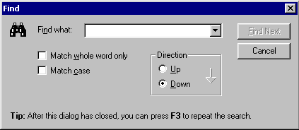
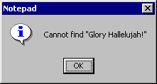
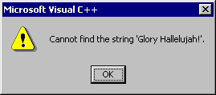
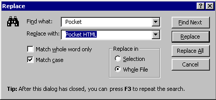

### Programming Industrial Strength Windows
[« Previous: File Management](Chapter-14-File-Management) — [Next: Printing »](Chapter-16-Printing)
# Chapter 15: Search and Replace

Windows offers a common dialog for straight searching and for search and replace. I have a strong dislike for this dialog. I dislike the modelessness of it, I dislike the simple edit field for the search string, and I dislike the dim-witted way it paints a default border on a disabled button (see Figure 22). Above all, I dislike the API, which is an invitation to spread related functionality around all the dark corners of a program.

**Figure 22: The Common Find Dialog.** Note the disabled default button, and cringe.

Given such strong feelings, you won’t be surprised when I tell you that TextEdit doesn’t use the common dialog for search and replace. You can see TextEdit’s Find dialog, implemented by the class FindDlg, in Figure 23. It looks quite similar to the common dialog, but there are differences more than skin deep.

**Figure 23: The TextEdit Find Dialog.** Although the presence of the drop-down list is the most obvious difference from the previous dialog, some of the less obvious differences are much more important.

FindDlg is modal. A modal dialog can only search for one string, whereas a modeless dialog can repeat a search any number of times before you close the dialog. To overcome this limitation, TextEdit has a Find Next command that repeats the last search. To make the existence of this command obvious, it is mentioned rather prominently on the face of the dialog.

FindDlg has a drop-down list associated with the edit field. The list remembers previous search strings, so that the user can just pick them from the list. FindDlg has even enlisted the help of the Windows registry, to preserve these strings across TextEdit sessions (as well as across coexisting TextEdit instances).

FindDlg handles enabling and disabling of the default button carefully; no dim-wittedness here. The presence of the drop-down list calls for extra care in the handling of defaultness; I’ll get back to that shortly.

FindDlg has a simple API, and takes care of almost all housekeeping itself. This is partly a benefit of its modality, of course, which does tend to simplify things.

## Default Button Handling

The default button, labeled Find Next, is enabled whenever the edit field contains text and disabled whenever the edit field is empty. The enableOK method in FindDlg takes care of enabling and disabling it. At the same time, it sets or removes the default border around the button, an important detail that the common Find dialog – and innumerable other dialogs – ignore.

There is one additional complication: What if the drop-down list is open? If the user hits return at this point, the list closes, but the default button action is not invoked. It is, in other words, unacceptable for the Find Next button to have a default border while the drop-down list is showing, no matter how many characters are in the text field.

One solution to this user interface glitch would be to catch the Enter key and actually invoke the default button immediately after closing the drop-down list. I discarded this solution for two reasons: In the first place, the implementation is more convoluted than you might think at first glance – handling CNB{"_"}CLOSEUP is not enough. (Can you see why?) In the second place, most drop-down lists don’t behave like that (although some do), so it would have introduced a quite unnecessary user interface inconsistency.

Actually implementing this functionality was more of a puzzle than I had expected, chiefly because the combobox notifications are peculiar. The CBN{"_"}DROPDOWN notification is sent before the list opens, while its opposite number, the CBN{"_"}CLOSEUP notification, is sent after the list has closed. In other words, the list is always closed at notification time. This precludes an elegant, common solution for all cases, in which I wouldn’t care whether the message was CBN{"_"}DROPDOWN or CBN{"_"}CLOSEUP. Instead, I would just ask the combobox by sending it the CB{"_"}GETDROPPEDSTATE message (using the ComboBox{"_"}GetDroppedState macro from windowsx.h).

At this point, it occurred to me that this problem is not specific to FindDlg, but completely general. I removed all this code from FindDlg, and instead used global subclassing (as described in [Chapter 4](Chapter-4-The-Mechanics-of-Subclassing)) to subclass the dialog window class. The result is in dlgSubclasser.cpp, and has a couple of interesting properties:

* No header file is associated with this file; it has, in a manner of speaking, no interface. The mere existence of the dlgSubclasser static variable is enough to initialize the subclassing.
* The subclassing works on all dialogs within TextEdit, including “system” dialogs such as printer properties.

< Listing 64: dlgSubclasser.cpp>

## Initializing the Dialog

But I digress. Let’s get back to FindDlg. What, if anything, should appear in the “Find what” field when the dialog appears? TextEdit’s functionality in this area is patterned after Visual {"C++"}. Perhaps I feel this is “right” merely because I’m used to it, but I don’t really think so. I’m equally used to Microsoft Word, but find its search and replace feature cumbersome compared with that of Visual {"C++"}.

If any text is selected when the user requests the search dialog, the selection is used as the initial search string. If no text is selected, the current word is used. If the caret is on white space, the previous search string is used, if any. If this is the first search ever, the “Find what” field comes up empty.

If the selection spans multiple lines, the selection is truncated at the first line boundary. It’s not that I have anything against line boundaries; they just don’t go too well with single-line edit boxes.

Another aspect of dialog initialization is often overlooked – its position. It’s not very nice if the dialog, when it appears, covers up the selected text, for example. For that reason, FindDlg has a member function called positionOutsideSelection that positions the dialog so as not to cover the selection. This is important for dialogs whose functionality applies to the text itself. It is of no interest to, for example, the File Open dialog, which deals with files rather than their contents.

As for all other dialogs, Dialog::dispatchDlgMsg takes care of the initial placement, including the remembered position. When FindDlg::onInitDialog takes over, it uses the positionOutsideSelection method to do final adjustments. If the dialog doesn’t overlap the selected text, fine, I’m done. In this context, there is always “selected text,” since if there isn’t any, I simply want to avoid the caret position. If the dialog obscures the caret or the selection, the method tries to move the dialog down below the selection. If there isn’t enough room on the screen, it tries to move up instead. If that doesn’t work either, it moves in the direction that obscures the least amount of selection, making sure that the whole dialog is inside the screen.

## Persistence

FindDlg has a memory. We’ve already seen how it remembers its position; it also remembers the ten most recently used search strings, the status of the “Match whole word only” and “Match case” checkboxes, and the search direction (up or down). 

The list of recently used search strings is read from the registry by the loadStrings method and saved to the registry by the saveStrings method. This “historical combobox” has a close kinship with the list of recently used files discussed in [Chapter 10](Chapter-10-Customization-and-Persistence), but is actually simpler in its implementation. How so? In addition to being a GUI component, a drop-down list box (or any list box, for that matter) can also be thought of as part of your data structure. Not only can you put strings into it; you can get them out again as well. Here’s another design principle:

**“Don’t duplicate data storage.”**

If your program maintains a list of strings, and a list box maintains a putatively identical list of strings, it is, for one thing, wasteful. (This not an issue in our case, but sometimes it is.) More important than waste is that dual storage affords inconsistencies an opportunity to creep in. If you make a habit out of violating this principle, it will turn around and bite you, sooner rather than later.

The historical combobox is simpler than the MRU file list simply because I do not duplicate data storage. The drop-down list, in its role as a respected member of the TextEdit data structure, takes care of the strings for us.

One final detail, while I’m on the subject of the combobox: The CB{"_"}FINDSTRINGEXACT message, which checks the strings in the drop-down list to find, if possible, an exact match, is not case-sensitive. I built the function findStringExact on top of CB{"_"}FINDSTRINGEXACT (or rather, on top of the ComboBox{"_"}FindStringExact macro) to get case sensitivity.

## Text Not Found

When Notepad fails to find the text you’re searching for, it displays a message box, as depicted in Figure 24. Notepad is in good company using a message box for this; others include Word for Windows (Figure 25) and Visual {"C++"} (Figure 26).

**Figure 24: Notepad didn’t find “Glory Hallelujah!”**

**Figure 25: Microsoft Word fails to find “Glory Hallelujah!”** The message box doesn’t tell you what Word failed to find.

**Figure 26: Visual {"C++"} fares no better.**

These message boxes are perfect examples of what Alan Cooper terms _excise_, user interface elements that contribute nothing towards fulfilling the user’s goals. If a message box were the only way the program could possibly communicate the failure of the search, we would have to accept this excise as necessary. It isn’t, though. TextEdit displays the information in the search dialog itself, as depicted in Figure 27.

*Figure 27: Glory be! TextEdit can’t find “Glory Hallelujah!” either.

This little trick saves the user one action – keystroke or mouse click – every time some text is not found. Over the course of a long lifetime, this sort of thing adds up.

## The Relationship between Dialog and Main Window

In a world of perfect software design, there would be almost no coupling between the Find dialog and the main window. The main window would need the ability to invoke the Find dialog, of course, as well as some means of getting back a search string (or a cancellation), but the Find dialog would live, perfectly encapsulated, off in its own fenced-off little universe, with no knowledge of the outside world.

This kind of thing is nice for programmers, but usually less so for end users. Therefore, there is considerable interaction between the Find dialog and the main window. The dialog must talk to the main edit widget if it wants to avoid obscuring the selected text, and it must also be able to execute a search while the dialog is still open, so that a failed search can be reported without closing the dialog. (This is why FindDlg has a pointer to the Editor object.)

## Replacing Text

FindDlg handles both search and replace. These functions use different dialog templates, but the same dialog function. To differentiate between the two modes, FindDlg has a flag named m{"_"}isReplace.

I decided to use the same dialog function for these two dialogs on the assumption that there was considerable functional overlap. While this is true, it may still have been a mistake; the Replace dialog is much more complex than the Find dialog, particularly in terms of user interaction. The code in FindDlg.cpp is littered with if ( m{"_"}isReplace ) conditionals, and this is unfortunate.

## The Visual {"C++"} Replace Dialog

Before I describe the TextEdit Replace dialog, I’d like to discuss its counterpart in Visual {"C++"}. I investigated this dialog quite thoroughly in preparation for my own design, and was left with a surreal feeling of having visited a Salvador Dali landscape, where the normal laws of logic don’t apply.

**Figure 28: The Visual {"C++"} Replace dialog without “iString” selected in the text window.** Since “iString” is not selected, Find Next is the default. No replacement is even possible, and if you click on Replace, it will do a Find Next, in spite of its label.

Figure 28 shows the V{"C++"} Replace dialog in action. At this point, the Find Next button is the default button, and no text is selected in the editor. If I hit return, the first occurrence of “iString” will be selected in the editor, and the Replace button becomes the default button, as depicted in Figure 29.

**Figure 29: The Visual {"C++"} Replace dialog with “iString” selected in the text window.** The Replace button is now the default.

So far, so good. But consider: No replacement is ever performed unless text matching the “Find what” field is selected in the editor. Nevertheless, the Replace button was enabled back in Figure 28, where no text was selected in the editor. What, then, does the Replace button do when it doesn’t replace anything? Answer: It is equivalent to the Find Next button! True, the Replace button has an implicit Find Next built into it when it actually performs a replacement, but I balk at clicking Replace to perform Find Next, and nothing else.

Even stranger, if I delete the text in the Find what field, all three buttons (Find Next, Replace and Replace All) remain enabled. I can’t for the life of me figure out what meaningful actions the buttons could possibly perform, and, as it turns out, none of them do anything whatsoever.

This contrasts with the V{"C++"} Find dialog, where the Find Next button is disabled when I delete the text in the Find what field. Here, on the other hand, the Find Next button retains its default looks even when disabled, exactly as Notepad’s corresponding button did in Figure 22.

It’s a common convention to change the text of a dialog’s Cancel button to “Close” whenever a change has been made that can’t be reversed from within the dialog. (There are those, including Alan Cooper, that maintain that this is Bad. I have mislaid my guru’s license and decline to comment.) The V{"C++"} Replace dialog changes the button caption to “Close” after performing a replacement, which is reasonable. It also changes the button caption to “Close” after performing a search, even though the text is unchanged! What were they thinking?

All that said, I must nevertheless admit that I’ve never had difficulties with the V{"C++"} Replace dialog. In spite of having used it for years, I didn’t consciously notice its surreal aspects until I started work on TextEdit. Still, since the V{"C++"} user interface is so superb in general, it saddens me all the more that the designers didn’t take the necessary thought and time to get these details right.

## The TextEdit Replace Dialog

The TextEdit Replace dialog is shown in Figure 30. It bears a passing resemblance to the {"C++"} Replace dialog; in particular, all the push buttons are identical.

In Figure 30, the text “Pocket” is not selected in the editor. Thus, no replacement is possible, and the Replace button is disabled.

**Figure 30: The TextEdit Replace dialog without “Pocket” selected in the edit widget.** In contrast to the Visual {"C++"} dialog in Figure 28, the Replace button is disabled.

In Figure 31, the user has hit Find Next, and the text “Pocket” has been selected in the editor. The Replace button has been enabled, and it has become the default button as well. The TextEdit Replace button, by the way, has an implicit Find Next built into it, just like Visual {"C++"}. Since we now have a selection, the “Replace in Selection” radio button has been enabled.

**Figure 31: The TextEdit Replace dialog with “Pocket” selected in the edit widget.** Its behavior now equals that of the Visual {"C++"} dialog in Figure 29.

In Figure 32, the user has checked “Replace in Selection.” In this case, Replace All is the only available action.

**Figure 32: The TextEdit Replace dialog with “Replace in Selection” selected**. Replace All is the only possible action.

User interaction with the Replace dialog is considerably more complicated than the interaction with the plain Find dialog. In particular, check out the adjustButtons method in FindDlg.cpp; it does considerably more work when the m{"_"}isReplace flag is set.

< Listing 65: FindDlg.cpp >
