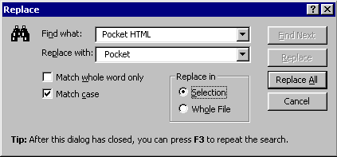

### Programming Industrial Strength Windows
[« Previous: Search and Replace](Chapter-15-Search-and-Replace.md) — [Next: Changing Fonts »](Chapter-17-Changing-Fonts.md)
# Chapter 16: Printing

In one sense, printing under Windows is similar to displaying stuff on the screen: You use GDI commands to draw text and graphics in a display context. You don’t obtain (or release) a printer display context the same way you obtain a screen display context, but once you have that display context, you use the same familiar set of GDI functions. 

In another sense, printing under Windows is different from displaying stuff on the screen. Even if we disregard, for a moment, the task of obtaining the printer display context, we still have to deal with pagination, margins, headers and footers, nothing of which applies to the screen. Besides, the edit window does the screen rendering for TextEdit in any case. On the printer, we have to render the text ourselves. (Actually, the rich edit control does understand something about printing, even though TextEdit doesn’t use this capability. The poor edit control, however, doesn’t understand much of anything.)

I’ll start with the print-related dialogs and describe the actual printing afterwards. But first of all…

## DEVMODE and DEVNAMES

A DEVMODE data structure contains information about device initialization and environment of a printer. Both the page setup and print dialogs use the getDevMode and setDevMode functions defined in devMode.cpp. The main point of this module is to provide persistent storage for the selected paper size, printer resolution and device orientation (landscape or portrait).

A DEVNAMES data structure contains strings that identify the driver, device and output port names for a printer. Both the page setup and print dialogs use the getDevNames and setDevNames functions defined in devNames.cpp. The main point of this module is to provide persistent storage for these strings.

The DEVNAMES structure is a nasty, variable-length thing, where you have to figure out the position of the strings from the offsets:

```C#
typedef struct tagDEVNAMES {
   WORD wDriverOffset;
   WORD wDeviceOffset;
   WORD wOutputOffset;
   WORD wDefault;
} DEVNAMES;
```
The documentation fails to mention whether the strings should be ANSI or Unicode; testing reveals them to be LPTSTRs.

< Listing 66: devMode.cpp >
< Listing 67: devNames.cpp >

## The Page Setup Dialog

TextEdit uses the standard common dialog for page setup. The setupPage function is defined in setupPage.cpp. The Page Setup dialog is closely related to the Print dialog; the values set during page setup are typically used during printing.

You invoke the standard page setup dialog by calling PageSetupDlg with a pointer to a suitably initialized PAGESETUPDLG as its lone parameter. The result looks like Figure 33.



**Figure 33: The Page Setup Dialog Box.**

The common page setup dialog provides for no less than two hook functions: the PageSetupHook and the PagePaintHook. The code in setupPage.cpp uses both, though the PagePaintHook is a dummy included only to show how it’s done. The default page is good enough for TextEdit, but if I were writing a graphics editor, I might implement custom rendering of the sample page.

< Listing 68: setupPage.cpp >

## The Print Dialog

TextEdit uses the standard common dialog for printing. The printFile function is defined in printFile.cpp. The Print dialog is closely related to the Page Setup dialog; the values set during page setup are typically used during printing.

You invoke the standard print dialog by calling PrintDlg with a pointer to a suitably initialized PRINTDLG as its lone parameter. The result looks like Figure 34.


**Figure 34: The Print Dialog Box.**

When you are certain of running under Windows 2000, you may use PrintDlgEx instead, which gives you extended functionality.

The print dialog is special in that it may be the sole manifestation of TextEdit; this happens if TextEdit is started with the /p switch. If so, the WM{"_"}INITDIALOG handler adds the file’s title to the dialog title.

The “Selection” radio button must be disabled if no text is selected. Obviously, no text is ever selected when TextEdit is invoked with one of the printer switches.

The printing switches give rise to another complication: What if the file in question is already open in another instance of TextEdit? This is handled in activateOldInstance, which activates the old instance, then sends it an ID{"_"}FILE{"_"}PRINT command. This approach is the reason why the parent window of the Print Common dialog is GetLastActivePopup( m{"_"}hwndMain ) rather than plain m{"_"}hwndMain. There’s always the chance that a dialog box is open in the running instance. Two modal dialog boxes parented to the same window is not merely asking for trouble, but insisting on trouble. Only one of them will have a keyboard interface, and as soon as one is killed, the parent is again enabled, with the remaining dialog displaying a distinctly modeless behavior. Better, then, to parent the print dialog to the existing dialog.

< Listing 69: printFile.cpp >

## Text Rendering and Pagination

Actual printing is done by the print method in the Document class. It calculates the printable area from the margins and printer device context metrics, then goes into a loop where it calls printSingleCopy for each requested copy. As usual, a couple of the classes involved have exception safety as their sole purpose: PrinterDC and PrinterDoc.

The printSingleCopy method loops on getLine, retrieving lines one by one until it runs out of lines. Each physical line may be broken any number of times if it is too wide to fit on a single line; this occurs no matter what the WordWrap setting is. A new page, including a page header, is emitted whenever necessary. 

The font used for printing is created by the createPrintFont method in the Document class. It is the same font used for display, scaled to (approximately) the same physical size.

The pageHeader method is responsible for rendering the page header.

< Listing 70: print.cpp >

