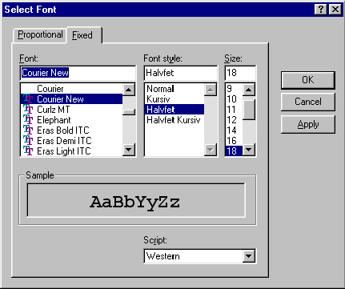

### Programming Industrial Strength Windows
[« Previous: Printing](Chapter-16-Printing.md) — [Next: Going Abroad »](Chapter-18-Going-Abroad.md)
# Chapter 17: Changing Fonts

TextEdit allows the user to select one proportional font and one fixed-width font. These selections are global across all instances of TextEdit, but it is quick to switch between proportional and fixed-width font, and the selected font is retained for individual files and for file types.

The TextEdit Font Dialog is an example of implementation problems overpowering user requirements, a problem I talked about in Chapter 2. My original plan called for a single dialog for font customization, looking something like Figure 35:



**Figure 35: The Font dialog that never was.** Is there a bug in WM_CHOOSEFONT_SETLOGFONT, or am I all thumbs?

Figure 35 is based on the Font common dialog; I merely added a tab control. I figured that judicious use of the WM_CHOOSEFONT_SETLOGFONT and WM_CHOOSEFONT_GETLOGFONT messages in response to tab clicks would serve to change the dialog’s contents appropriately.

This solution would have been ever so much nicer than having two separate dialogs, but it never happened. The catch? WM_CHOOSEFONT_SETLOGFONT does not, as near as I can figure out, work. To realize the design in Figure 35, I would’ve had to implement a font selection dialog from scratch. While this is certainly possible, it is considerably more work than customizing a common dialog. Besides, it’s best to stick with common dialogs whenever possible. If you don’t, the release of the next Windows version may leave you in the dust. 

At any rate, I ended up putting font selection into the Options dialog (see Figure 16), with a font selection dialog box available from two different push buttons. The font selection dialogs are also available by double clicking on the Fixed Font or Proportional Font buttons in the tool bar, or through the Ctrl{"+"}Shift{"+"}F accelerator.

## Subclassing the Font Common Dialog

Changing the looks of the common Font Selection dialog is a matter of creating a replacement dialog template, an approach quite different from that used with the Open and Save dialogs. The standard template supplied by Microsoft is shown in Listing 71, FONT.DLG; TextEdit’s dialog template (IDD_FONT) is based on this. All I did was hide some unneeded controls and change the size of the sample display to fully utilize the vacated space.

**Listing 72: FONT.DLG**
{{
/*++
Copyright (c) 1990-1997,  Microsoft Corporation  All rights reserved.
Module Name:
    font.dlg

Abstract:
    This module contains the resource descriptions for the Win32
    font common dialogs.
--*/

//
//  Font Dialogs.
//

FORMATDLGORD31 DIALOG 13, 54, 263, 196
STYLE DS_MODALFRAME | WS_POPUP | WS_CAPTION | WS_SYSMENU |
      DS_CONTEXTHELP | DS_3DLOOK
CAPTION "Font"
FONT 8, "MS Shell Dlg"
BEGIN
   LTEXT         "&Font:", stc1, 7, 7, 40, 9
   COMBOBOX      cmb1, 7, 16, 98, 76, CBS_SIMPLE | 
                 CBS_AUTOHSCROLL | CBS_SORT | WS_VSCROLL | 
                 WS_TABSTOP | CBS_HASSTRINGS |
                 CBS_OWNERDRAWFIXED | CBS_DISABLENOSCROLL
   LTEXT         "Font st&yle:", stc2, 110, 7, 44, 9
   COMBOBOX      cmb2, 110, 16, 62, 76, CBS_SIMPLE | WS_VSCROLL |
                 CBS_DISABLENOSCROLL | WS_TABSTOP
   LTEXT         "&Size:", stc3, 177, 7, 30, 9
   COMBOBOX      cmb3, 177, 16, 27, 76, CBS_SIMPLE | WS_VSCROLL |
                 WS_TABSTOP | CBS_HASSTRINGS | CBS_OWNERDRAWFIXED |
                 CBS_SORT | CBS_DISABLENOSCROLL
   DEFPUSHBUTTON "OK", IDOK, 210, 16, 45, 14, WS_GROUP
   PUSHBUTTON    "Cancel", IDCANCEL, 210, 32, 45, 14, WS_GROUP
   PUSHBUTTON    "&Apply", psh3, 210, 48, 45, 14, WS_GROUP
   PUSHBUTTON    "&Help", pshHelp, 210, 64, 45, 14, WS_GROUP
   GROUPBOX      "Effects", grp1, 7, 97, 98, 72, WS_GROUP
   AUTOCHECKBOX  "Stri&keout", chx1, 13, 110, 49, 10, WS_TABSTOP
   AUTOCHECKBOX  "&Underline", chx2, 13, 123, 51, 10
   LTEXT         "&Color:", stc4, 13, 136, 30, 9
   COMBOBOX      cmb4, 13, 146, 82, 100,
                 CBS_DROPDOWNLIST | CBS_OWNERDRAWFIXED | 
                 CBS_AUTOHSCROLL | CBS_HASSTRINGS | WS_BORDER |
                 WS_VSCROLL | WS_TABSTOP
   GROUPBOX      "Sample", grp2, 110, 97, 94, 43, WS_GROUP
   CTEXT         "AaBbYyZz", stc5, 118, 111, 77, 23,
                 SS_NOPREFIX | NOT WS_VISIBLE
   LTEXT         "", stc6, 7, 176, 196, 20, SS_NOPREFIX | 
                 NOT WS_GROUP
   LTEXT         "Sc&ript:", stc7, 110, 147, 30, 9
   COMBOBOX      cmb5, 110, 157, 94, 30, CBS_DROPDOWNLIST |
                 CBS_OWNERDRAWFIXED | CBS_AUTOHSCROLL | 
                 CBS_HASSTRINGS | WS_BORDER | WS_VSCROLL | WS_TABSTOP
END
}}

Note the script selection combo box in the dialog. This means that we must save the lfCharSet member of the LOGFONT structure between invocations. With Unicode, this doesn’t matter, but with ANSI, it does. More about this in Chapter 18.

All TextEdit must do to show the font selection dialog is call the selectFont function, passing a pointer to a LOGFONT structure. If the user uses OK to dismiss the dialog, any changes to the font will be reflected in the LOGFONT structure upon return.

The font dialog is invoked with the Options dialog as its parent if you click either of its Change buttons. It is invoked with the main window as its parent if you double-click one of the two font buttons on the toolbar or use the Ctrl{"+"}Shift{"+"}F accelerator. In the latter case, the font selection dialog is subject to the same positioning persistence as all other TextEdit dialogs, i.e., it will reappear where you last put it, relative to the main window. In the former case, though, the dialog is placed flush below either the Fixed Font or Proportional Font sample widgets, depending on which Change button you clicked. This reinforces the connection between the dialog and the sample widget, and reduces your chance of getting confused about whether you’re modifying the fixed or the proportional font. This is indeed a minor detail, but every little bit helps.

A pointer to the rectangle of the sample widget is passed in the **prcAvoid** parameter to **selectFont**; this, in turn, is passed to the **FontHookProc** in the **lCustData** member of the **CHOOSEFONT** structure. All callers except the Options dialog pass null instead.

The **Editor** class has responsibility for the fonts used in the editor; it is the responsibility of selectFont’s callers to get and set the fonts, as demonstrated by this excerpt from **mainwnd.h**:

```C++
PRIVATE void onViewSetFixedFont( HWND hwnd ) {

   LOGFONT logFont = *getEditor( hwnd )->getLogFont( true );
   if ( selectFont( hwnd, &logFont, 0, CF_FIXEDPITCHONLY ) ) {
      getEditor( hwnd )->setLogFont( &logFont, true );
   }
}

PRIVATE void onViewSetProportionalFont( HWND hwnd ) {

   LOGFONT logFont = *getEditor( hwnd )->getLogFont( false );
   if ( selectFont( hwnd, &logFont ) ) {
      getEditor( hwnd )->setLogFont( &logFont, false );
   }
}

PRIVATE void onViewSetFont( HWND hwnd ) { // Ctrl+Shift+F

   if ( getEditor( hwnd )->hasFixedFont() ) {
      onViewSetFixedFont( hwnd );
   } else {
      onViewSetProportionalFont( hwnd );
   }
}
```

< Listing 72: FontDlg.cpp >
