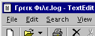
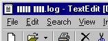
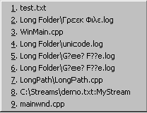

### Programming Industrial Strength Windows
[« Previous: Changing Fonts](Chapter-17-Changing-Fonts.md) — [Next: Meanwhile, in the Background »](Chapter-19-Meanwhile-in-the-Background.md)
# Chapter 18: Going Abroad

Even though I’m running the US edition of Windows NT 4 Workstation, I can nevertheless create files with Greek names; my file system is NTFS, so file names are Unicode. The question is – can I display those file names? The answer is – it depends.



**Figure 36: Γρεεκ Φιλε.log (Greek File.log – English written using the Greek alphabet. An even Greeker file name would be Εκθεσι Ελληνικον.log.)** The file name is Unicode, the program is Unicode and the Unicode title font contains the required Greek characters.

Figure 36 shows a screen from a Unicode build of TextEdit, using a font (Tahoma) that contains the Greek Unicode characters (0x0370–0x03cf). In Figure 37, I’ve switched to MS Sans Serif, which does not, and the Greek characters can’t be displayed. A default character – a black rectangle – is displayed instead. It would be a different matter if Greek were installed as the system default language. In that case, a different code page of MS Sans Serif would be installed, and character codes between 128 and 255 would be used to display the Greek characters, even though the file name characters are actually from the Greek Unicode page. The Unicode character code for upper-case alpha, for example, is 0x0391; it obviously can’t be represented in an 8-bit code.



**Figure 37: A Truly Greek File Name.** (Apologies to all Greeks. This is Chinese to you, of course.). In this case, the problem lies with the MS Sans Serif font.

Figure 38 shows a Tahoma menu. Note item 2, a beautiful rendition of a Greek file name. Even more interesting are items 5 and 6, leftovers from an ANSI build. They show how difficult life can be for an ANSI application on a Unicode file system. The WideCharToMultiByte function has mapped the Gamma, Epsilon and Phi characters with a modicum of success. The rest were deemed untranslatable, and thus replaced by the default character. Since I didn’t specify a default character, the default default character was used, and, since this doubly default character is a question mark, the file name is more than merely wrong: The question mark is a wild-card character, so the file name is illegal.



**Figure 38: Tahoma Menu in Unicode Build.** Items five and six show how badly Unicode-to-ANSI translations can screw things up.

The moral is that Windows NT is a Unicode system to the core, and best served by Unicode applications using Unicode fonts. The problem with that, though, is that we’d all like to create a single executable to run under both Windows 9x and Windows NT. ANSI applications on NT run into the “G?ee? F??e” problem from Figure 38, and creating a Unicode application that runs well on Windows 9x is a major undertaking – you must build an architectural layer that wraps all string-related APIs. The getPathFromIDList set of functions in utils.cpp gives you an idea about what this entails.

## Resource Files

One reason for the existence of resource files as separate from the code is to permit translations between languages without touching the code itself. To create a German TextEdit version, all you have to do is translate the resources into German and relink the application. 

That much has been true since the early days of Win16. Win32 introduced language tags for resources. This allows you to have any number of copies of, say, a dialog box, all with the same identifier, provided they have different language tags. Consider this resource script:

{{
LANGUAGE LANG_ENGLISH, SUBLANG_ENGLISH_US
STRINGTABLE DISCARDABLE 
{
   IDS_VERSION          "Version:"
   ...
   IDS_STRING_NOT_FOUND "Unable to find <b>%1</b>"
}

LANGUAGE LANG_NORWEGIAN, SUBLANG_NORWEGIAN_BOKMAL
STRINGTABLE DISCARDABLE 
{
   IDS_VERSION          "Versjon:"
   ...
   IDS_STRING_NOT_FOUND "Fant ikke <b>%1</b>"
}
}}

What happens if you call loadString( IDS_VERSION )? If you’re running Windows NT, the current thread locale decides. The current thread locale, in turn, is by default initialized to the user locale selected in the Regional Settings Control Panel applet. If you’re running Windows 95, the system default locale decides – Windows 95 does not support thread locales or user locales.

If a resource doesn’t exist in the desired language, the system has several fallback positions. The search order is as follows:

# Primary language/sublanguage
# Primary language/any sublanguage
# Language neutral
# English
# Any 

If the current locale is French, the loadString example returns the US English resource, according to rule 4 above. If the current locale is Norwegian Nynorsk (rather than Norwegian Bokmål), the example returns the Norwegian resource, since there’s a match in the primary language, and rule 2 applies. If there were only one string table resource, tagged with LANG__SWAHILI, you would get the Swahili string no matter what the current locale (rule 5).

Windows NT allows you to change the user default language on the fly from the Control Panel. If this happens, a WM_SETTINGCHANGE message is broadcast, allowing us to change the application’s language on the fly. The main window’s onSettingChange function, in mainwnd.cpp, contains the following code fragment:

```C++
// Switch languages, if indicated:
const LCID lcid = GetUserDefaultLCID();
if ( GetThreadLocale() != lcid ) {
   assert( isWindowsNT() );
   verify( SetThreadLocale( lcid ) );
   verify( DestroyMenu( GetMenu( hwnd ) ) );
   SetMenu( hwnd, LoadMenu( getModuleHandle(), MAKEINTRESOURCE( IDR_MENU ) ) );
   verify( DrawMenuBar( hwnd ) );
   getEditor( hwnd )->loadAcceleratorTable();
}
```
Presto, language change! The important part is to reload the menu and the accelerator table. Dialog resources are loaded anew each time the dialog is invoked. Any dialog box that’s open at the time of the language switch will, unfortunately, remain in the old language until the next time it is invoked. I’m not going to tackle that problem, though; I feel that I’m approaching a point of diminishing returns.

You can switch languages programmatically, too, by calling the SetThreadLocale function. The options dialog (OptionsDlg.cpp) has an example of this; it lets you select the desired language from a combo box. Under Windows 9x, however, this combo box is disabled. Although SetThreadLocale is present in all versions of the Windows API, it has no effect under Windows 9x. The best you can do under Windows 9x is to change the system default locale, then reboot the system. 

To change languages on the fly under Windows 9x, your best approach is to put all the resources into a DLL, then create differently-named versions of this DLL for each supported language. With such an approach, the call

```C++
LoadMenu( getModuleHandle(), ... );
```
above would change to something like

```C++
LoadMenu( getResourceModuleHandle(), ... );
```
where getResourceModuleHandle would return the module handle of the DLL matching the currently selected language. 

If I haven’t said so before, I’ll say it now: Windows NT is a much, much better operating system than Windows 9x.

## Formatting Messages

Traditional C programming relies on the printf family of functions to format messages. Thus, one writes:

```C++
wsprintf( szMsg, "File %s not found", szFile );
```
Now, if this string were hard-coded, a translation into German would entail changing that line of code, then recompiling:

```C++
wsprintf( szMsg, "Datei %s nicht gefunden", szFile );
```
To avoid this, we store the string in a string table. Translation no longer requires recompilation, and the code might look like this:

```C++
wsprintf( szMsg, loadString( IDS_FILE_NOT_FOUND ).c_str(), szFile );
```
This is better, but one problem remains. When you use wsprintf (or any of its relatives), the order of the arguments is fixed. This is not a problem in the example above, but is sometimes a problem in translations involving two or more inserts, where argument reordering may be preferable, or even required.

The Win32 API offers an alternative called FormatMessage. This very capable function lets you vary the order of the inserts; rather than specifying %s and %d, it wants %1!s! and %2!d!, which lets you switch the first and second inserts in the formatting string, or even repeat an insert. It can retrieve descriptive text for Windows errors, and allocate the buffer for it if you so wish. This paragon of flexibility can do everything but tie your shoelaces.

The functions defined in formatMessage.cpp wraps FormatMessage in functions that take printf-style variable-length argument lists. One of them takes a resource string ID rather than a string.

< Listing 73: formatMessage.cpp>

## Initialize the Output String!

The formatMessageV function is the real workhorse. It defines text buffer that FormatMessage will fill:

```C++
TCHAR sz[ MAX_LENGTH ](-MAX_LENGTH-) = { 0 };
```
Note that this initializes the buffer to an empty string. All string declarations in TextEdit are initialized in the same manner, but in this case, it is particularly important: If the format specification string is empty, FormatMessage does nothing to the output string – it does not even empty it. If it were uninitialized, the best that could happen would be the return of a garbage string. As for the worst that could happen, the sky is the limit: If the uninitialized array doesn’t contain a terminator somewhere, the String constructor (called when the function returns) will continue to read beyond the end of the array.

## Beware of References!

The formatMessage function with a string argument was originally defined as follows:

```C++
String __cdecl formatMessage( LPCTSTR pszFmt, ... );
```
This was fine, except that most places that called the function had a formatting String rather than a formatting LPCTSTR, and the code was littered with calls to String::c_str, there being no conversion operator available. Why not, I thought, change the formal parameter to a const String&, and avoid the conversion hassle? Any calls to formatMessage that actually used an LPCTSTR would be OK, since a suitable String constructor is available to convert the LPCTSTR to a String.

In innocent ignorance, I changed formatMessage to the following:

```C++
String __cdecl formatMessage( const String& strFmt, ... ) {

   va_list vl;
   va_start( vl, strFmt );
   const String strMessage = formatMessageV( strFmt, vl );
   va_end( vl );

   return strMessage;
}
```
It promptly blew up. It took me a long debugging session to figure out what the problem was; can you see it?

The culprit is the application of the va_start macro to a reference. The strFmt reference argument is actually a pointer to a String object, but there’s no way to get the address of the pointer value. The address operator retrieves the address of the strFmt String object, while va_start needs the address of the pointer to the strFmt object that is actually passed on the stack. The compiler can’t catch this, of course, and the va_list gets screwed up something horribly.

Solving the problem was then a simple trade-off between efficiency (an LPCTSTR parameter) and readability at the point of call (a String parameter). For TextEdit, I chose readability, and changed formatMessage to this:

```C++
String __cdecl formatMessage( const String strFmt, ... ) {
```
The string is now passed by value, and must therefore be copied. Inefficient, yes, but TextEdit doesn’t format messages frequently enough to make it much of an issue.

## Formatting Numbers

TextEdit displays numbers in several places: In the status bar, it displays the current line and column; in the Properties dialog, it displays file sizes in three different ways.

Consider the number 1834597891. This is a nice, big number, and difficult to grasp it is, too. Quick, how big is it? Is it more or less than one billion?

The easy way to format a number for display is to use printf( "%d", 1834597891 ), which gives the result you just saw. What we want is 1,834,597,891 – perhaps. In the US, the comma is used to separate groups of thousands; in Europe, it is more common to use a period (1.834.597.891), reserving the comma for the decimal point. In Norway, we like to use spaces instead, and to really confuse the issue, some locations don’t even group by thousands, or even by the same number of digits for each group.

To find out what the correct format is, we have the GetLocaleInfo function to help us. If you call it with LOCALE_STHOUSAND as the second parameter, it will return a string containing the thousands separator. For example, if you’re using the US locale, this code snippet will set szThousandSep to “,”:

```C++
TCHAR szThousandSep[ 10 ](-10-) = { 0 };
GetLocaleInfo( LOCALE_USER_DEFAULT, LOCALE_STHOUSAND,  szThousandSep, dim( szThousandSep ) ) );
```
If you call **GetLocaleInfo** with **LOCALE_SGROUPING** as the second parameter, it will return a string describing how you should group the digits. The grouping string contains digits separated by semicolons; the final digit should be zero. As soon as the zero has been reached, the last group size given should be repeated ad infinitum. A couple of examples will make this clear: "3;0" specifies groups of three digits, while "3;2;0" specifies one group of three digits, then groups of two from there on. 

The **formatNumber** function (in **formatNumber.cpp**) takes all this into account when formatting numbers. The one implementation issue worth mentioning is that the string is built backwards, and then reversed at the end. This could lead us astray if a thousand separator string of more than one character came along. To protect against such a potential mishap, the thousands separator string is itself reversed before we start applying it.

< Listing 74: formatNumber.cpp>

By now, you will have figured out that the number 1834597891 is larger than one billion. The TextEdit Properties dialog displays file sizes in two formats, one of which would be 1.8 GB for our example (or 1,8 GB in some parts of the world). This bit of formatting is performed by a Windows function from SHLWAPI called StrFormatByteSize; it is used in PropertiesDlg::setInfo (PropertiesDlg.cpp).

GetNumberFormat is another Windows function useful for number formatting. I would have used it in formatNumber except that, by default, GetNumberFormat adds decimals to the output string. Overriding the default behavior involves filling in a NUMBERFMT structure, and suddenly the use of GetNumberFormat is more trouble than it is worth. In addition, the NUMBERFMT structure has a structural problem: It has but a single Grouping member (of type UINT) to handle digit groupings. In other words, GetNumberFormat does not support differently sized groupings.

## Formatting Dates, and Money, and…

I have already covered most of the formatting that TextEdit does – TextEdit is a light formatter. The Properties dialog needs to display time stamps, though. Their formatting is handled by the formatFileTime function, defined in PropertiesDlg.cpp:

```C++
PRIVATE String formatFileTime( const FILETIME& ft ) {
   FILETIME local = ft;
   verify( FileTimeToLocalFileTime( &ft, &local ) );
 
   SYSTEMTIME st;
   verify( FileTimeToSystemTime( &local, &st ) );

   TCHAR szTime[ 100 ](-100-) = { 0 };
   GetTimeFormat( LOCALE_USER_DEFAULT, 0, &st, 0, szTime, dim( szTime ) );
 
   TCHAR szDate[ 100 ](-100-) = { 0 };
   GetDateFormat( LOCALE_USER_DEFAULT, DATE_LONGDATE, &st, 0, szDate, dim( szDate ) );
   
   return formatMessage( _T( "%1 %2" ), szDate, szTime );
}
```
Most commercial applications do more, dealing as they do with dates, money, calendars, phone numbers, units of measurement and a host of other stuff that varies from locale to locale. Just to give you an idea of the things you must consider, here is a list of the possible values for the second argument to GetLocaleInfo:

{{
LOCALE_ILANGUAGE
LOCALE_SLANGUAGE
LOCALE_SENGLANGUAGE
LOCALE_SABBREVLANGNAME
LOCALE_SNATIVELANGNAME
LOCALE_SSORTNAME
LOCALE_ICOUNTRY
LOCALE_SCOUNTRY
LOCALE_SENGCOUNTRY
LOCALE_SABBREVCTRYNAME
LOCALE_SNATIVECTRYNAME
LOCALE_IDEFAULTLANGUAGE
LOCALE_IDEFAULTCOUNTRY
LOCALE_IDEFAULTANSICODEPAGE
LOCALE_IDEFAULTOEMCODEPAGE
LOCALE_IDEFAULTCODEPAGE
LOCALE_IDEFAULTEBCDICCODEPAGE
LOCALE_SLIST
LOCALE_IMEASURE
LOCALE_SDECIMAL
LOCALE_STHOUSAND
LOCALE_SGROUPING
LOCALE_IDIGITS
LOCALE_ILZERO
LOCALE_INEGNUMBER
LOCALE_SNATIVEDIGITS
LOCALE_SENGCURRNAME
LOCALE_SNATIVECURRNAME
LOCALE_SCURRENCY
LOCALE_SINTLSYMBOL
LOCALE_SMONDECIMALSEP
LOCALE_SMONTHOUSANDSEP
LOCALE_SMONGROUPING
LOCALE_ICURRDIGITS
LOCALE_IINTLCURRDIGITS
LOCALE_ICURRENCY
LOCALE_INEGCURR
LOCALE_SDATE
LOCALE_STIME
LOCALE_STIMEFORMAT
LOCALE_SYEARMONTH
LOCALE_SSHORTDATE
LOCALE_SLONGDATE
LOCALE_IDATE
LOCALE_ILDATE
LOCALE_ITIME
LOCALE_ICENTURY
LOCALE_ITLZERO
LOCALE_IDAYLZERO
LOCALE_IMONLZERO
LOCALE_S1159
LOCALE_S2359
LOCALE_ICALENDARTYPE
LOCALE_IOPTIONALCALENDAR
LOCALE_IFIRSTDAYOFWEEK
LOCALE_IFIRSTWEEKOFYEAR
LOCALE_SDAYNAME1 through LOCALE_SDAYNAME7
LOCALE_SABBREVDAYNAME1 through LOCALE_SABBREVDAYNAME7
LOCALE_SMONTHNAME1 through LOCALE_SMONTHNAME13
LOCALE_SABBREVMONTHNAME1 through LOCALE_SABBREVMONTHNAME13
LOCALE_SPOSITIVESIGN
LOCALE_SNEGATIVESIGN
LOCALE_IPOSSIGNPOSN
LOCALE_INEGSIGNPOSN
LOCALE_IPOSSYMPRECEDES
LOCALE_IPOSSEPBYSPACE
LOCALE_INEGSYMPRECEDES
LOCALE_INEGSEPBYSPACE
LOCALE_IPAPERSIZE
}}
Whew! This is not a reference book, but I couldn’t resist throwing in that list, just to give you a flavor of what software translation can entail. All this, and we haven’t even begun to consider the implications of different cultural conventions!

(Did you notice LOCALE_SMONTHNAME13, by the way? No, it’s not a misprint.)
