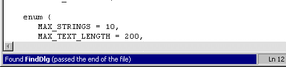

### Programming Industrial Strength Windows
[« Previous: The Road Ahead](Chapter-1-The-Road-Ahead.md) — [Next: Designing for Programmers »](Chapter-3-Designing-for-Programmers.md)
# Chapter 2: Designing for Users

From the Unix world comes a text editor named **vi**. It’s powerful and fast – provided you know how to use it. The problem with vi is that it is difficult to learn. A host of keyboard commands must be learned by heart – the user interface doesn’t give you a clue as to what you can and can’t do. The problem is compounded by vi’s several modes – it has different modes for text insertion and text manipulation, for example. The modes are in themselves no disaster, but their invisibility is. Nothing indicates whether your keystrokes will be interpreted as text to be inserted or commands to be executed.

The vi editor violates the following principle of good user interface design:

**“Program state should be visible in the user interface.”**

Curiously, by editing a configuration file (if you can find it), you can cause vi to display which mode it’s in. This information is presented in a piece of screen real estate that’s never used for anything else. Why this should require the editing of an obscure configuration file, or even be optional, is beyond me. 

This doesn’t bother expert vi users much, but it is truly galling for novices and occasional users. (I should know; I’ve been a member of all three categories.) One of our tasks as software designers is to ease the path from ignorance to enlightenment, and showing the user just what’s going on is a big step in the right direction.

A traditional quandary for software design is the simultaneous accommodation of novices and experts. This is similar to learning to bicycle: once you know how, you’d like to get rid of the training wheels – they are just an impediment to efficient bicycling. 

[Sidebar: Conceptual Models](Sidebar_-Conceptual-Models)

Catering to all user groups is difficult. Try it anyway; it can be done. Furthermore, the process of trying can help you refine or even totally rethink the application’s conceptual model. 

The following is a helpful guiding principle on the way:

**“Provide more than one way of doing things.”**

The rationale behind this is that the novice, by definition ignorant of what can and cannot be done, must be able to browse his way to all the possibilities. This is what drop-down menus are for. The expert already knows what’s in those menus, and needs a faster access path. This is what keyboard shortcuts are for. As an essential part of this dualism, the keyboard shortcuts are displayed on the menus, giving the novice a chance of (a) realizing they exist and (b) learning them.

To design excellent software, you must put yourself in the user’s shoes. Playing with your software is not the user’s goal. The user’s goal is to accomplish a task, such as changing the contents of a text file. Your job is to help the user reach this goal as painlessly as possible, not to show off your programming skills. (I know this sounds tautological, but it can really be difficult. In Chapter 20 I’ll tell you about one part of TextEdit where I goofed; I’m sure there are others.) The best user interfaces are invisible, in the sense that they don’t put up a barrier between the user and the task. Achieving this takes more design and programming skills than anything else I know; unfortunately, it’s also less obvious than all the “cool” stuff, and less likely to bring you rave reviews.

User-centered design is a subject worthy of its own book; in this chapter, I confine myself to a few highlights. If you wish to pursue the subject further, Laura Arlov’s GUI Design for Dummies or Alan Cooper’s About Face are good places to begin.

## Polite Applications

Here is another guiding principle:

**“Don’t bother the user unnecessarily!”**

Alan Cooper uses the term excise to describe dialogs, message boxes, window movements and other things that do not contribute to the user’s goal (which, as I have already mentioned, is to accomplish a task, not to play with your software). Often enough, error messages are there for the programmer’s convenience rather than the user’s. Perhaps you should redesign the application to handle the error gracefully and invisibly, or perhaps you should redesign the conceptual model to make the “error” go away.

When you type commands in a console window, for example, there’s always the possibility that you will mistype a file name. The resulting error must be handled somehow; I’m not suggesting that you pretend everything is fine when in fact it is not. If, on the other hand, you must select a file name from a list of available files, the possibility of mistyping goes away.

Some message boxes are just plain unnecessary. TextEdit uses the status bar to display messages; this makes for a more conversational and relaxed style of interaction. (If the user has chosen to hide the status bar, TextEdit may display a message box as a last resort.) 

The status bar has one big problem in this role: Most people don’t pay it much attention. To remedy this problem, TextEdit’s status bar displays highlighted text whenever it has something substantial to say (as shown in Figure 1).

**Figure 1: Status bar with a message.** Highlighting makes the user pay attention.

In [Chapter 15](Chapter-15-Search-and-Replace.md), I’ll show you how to do away with message boxes in connection with search and replace.

## Robustness

No matter how well designed, a program that doesn’t work the way it’s supposed to work is unusable. In particular:

**“Never lose the user’s data!”**

This is so obvious that I won’t belabor the point. A large part of a program’s robustness is a result of the imagination you bring to bear in imagining wild scenarios for what users might do. 

Robustness is more than not losing data, though. If the application is unable to present a consistent world-view to the user, the user may rightly start to wonder whether the application really knows what’s going on. The following scenario is obvious after the fact, but I was months into the TextEdit project before I thought of it: What happens if the user changes the file type during an editing session?

First, you need to know the following about TextEdit:

# Although TextEdit doesn’t have a Save As command, you can change the file name, including the extension, from the File menu or from the Properties dialog box.
# TextEdit displays the icon that belongs with the file type, rather than an application-specific icon. This, I feel, is in a quite document-centric spirit.

If the user opens the properties dialog, changes the file extension from .txt to .cpp and clicks the Apply button, the icon on the dialog should change (see Figure 2). In addition, the textual type description should change, the dialog title should change, and the time stamp of last file access should change.

**Figure 2: TextEdit displays different icons for different file types.**

This may seem simple and obvious, perhaps, but that’s just because “everything that’s known is obvious.” The average application – and the Windows desktop itself – has many, many such minor glitches. To minimize them, you must use your imagination.

## Focused Design

It is important to design your application before implementing it. If you don’t, implementation issues will overshadow user requirements, and your application will lack focus. If you design as you go along, the result is likely to be a hodge-podge of bolted-together features rather than a unified whole. This is particularly true when a whole programming team is working on an application or a suite of applications. All team members won’t think alike.

State the basic mission first. If somebody asks, “What does the program do?” how do you answer that in a single sentence?

## The Windows Logo Program

The requirements for the Microsoft Windows Logo program contain many good ideas, and it is worth your while to check them out (http://msdn.microsoft.com/). I do not care one whit, however, about whether TextEdit qualifies for the Windows logo. The logo program is designed to promote Microsoft’s agenda rather than yours or mine. If a logo requirement makes sense, fine. If not, disregard it – unless that Windows logo is important to your marketing department. The World According to Marketing catches up with us all, occasionally. 

User interface standards are good, insofar as they make it easier for users to move between different applications. Standards can also be bad, insofar as they help propagate questionable practices. Don’t assume that a way of doing something is good merely because it is “standard.” Use your judgement, and feel free to break standards when there is good reason to. Don’t, however, break standards gratuitously.

## Usability Testing

To design excellent software, you must put yourself in the user’s shoes. Unfortunately, putting yourself in the user’s shoes becomes nearly impossible after you’ve worked on a program for a while. This doesn’t come about because all your compassion and empathy has suddenly left for places unknown, but because you get so used to your program that you can’t see it the way a stranger would, no matter how hard you try.

You can alleviate this problem by doing usability testing. This has nothing to do with what programmer’s usually think of as testing – usability testing is a design tool. You place someone (actually several someones, but one someone at a time, please) in front of your program, give that someone a task to perform, then step back and observe what happens. Do not provide assistance! The temptation to do so is often overwhelming, and while doing so is certain to please your test subject, you won’t learn anything that way. Success isn’t interesting; failure is. It’s when the user fails in his task, or takes too long succeeding, that you learn something useful.

Incidentally, you should put considerable care into the selection of tasks for usability testing, or you may find that what you’ve learned has little value. What is the purpose of the program? What is the user’s goal?

How does the user react to your program? Does he or she try to find a command in the wrong place? Perhaps you ought to move the command, or provide alternative access ways. Does the user have a totally wrong mental model of what’s happening? If so, perhaps the conceptual model should be made more visible. Perhaps you should redesign your program around a different conceptual model.

Usability testing is best done with a crude prototype – on paper, even. If you invest much time and effort in a prototype, it becomes your baby. You lose face when people find fault with it; you get defensive about it. This is the wrong attitude for usability testing. 

The right attitude for usability testing is to assume that your user interface is worthless, and pray that the users – who, no matter how wrong-headed, are always right – will show you just where you went wrong. If you find this attitude difficult, then at least try to simulate it by granting, for the sake of argument, the remote possibility that your software is not yet quite perfect.

After you’ve sucked this well dry, switch attitudes again. Users, no matter how good, are always wrong. They will tell you in specific detail how the software should behave, and they will probably be wide of the mark. All car owners have opinions on cars, but would you want one to design yours? You improve your design not by letting the users tell you how to do your job, but by observing where and how users go wrong.

(The attitudes described in the previous two paragraphs are extremes. The trick is to balance them just so.)

Truly interesting findings may suggest a total redesign. This will never happen towards the end of a project. A pervasive change at a late stage is horrendously expensive, whereas a pervasive change in the early design phase is dirt-cheap. Start usability testing as early as possible; you can pin down the conceptual model and basic functionality from a paper prototype. Later, you can use a succession of electronic versions to hone details.

Whatever else you do, don’t make a slip of the tongue and say “user testing” instead of “usability testing.” You’re testing the user interface, not the user, and if you don’t make this difference clear to your test subjects, before you know it you won’t have any.

## The Unified File Model

In _Tog on Design_, Bruce Tognazzini says that the sole reason applications for the original Macintosh had an explicit Save command was the machine’s lack of a hard drive. The machine’s single drive couldn’t hold both the program floppy and the data floppy at the same time, making automatic saving rather impractical. Even though the designers considered it conceptually wrong, explicit Save was forced upon them by this technological limitation.

The now-standard conceptual model makes explicit the two copies of the document – the one on the disk and the working copy in memory. It forces aspects of the underlying implementation upon the user. Programmers and power users are used to this; their mental model correctly describes the true state of affairs.

For beginners, however, the concept of memory versus disk is a real hurdle. My father is a case in point. After he swapped his typewriter for a computer, he continued to use the computer as if it were a typewriter, limiting his editing to occasional use of the backspace key. He never saved his files; once he got his documents out of the printer, he was happy to let them evaporate. This was not because he’s lacking in either intelligence or typing skills, but because this strange world of computer software was disconnected from anything in his experience. His mental model was of the computer as a time-delayed typewriter.

Eventually, he did learn how to save, and looked upon this newfound ability, and found it good. With a program offering a different conceptual model, he would have had the ability to save from the start.

In About Face, Alan Cooper describes what he calls the unified file model. In the unified file model, there’s just the one file – on disk. TextEdit uses this conceptual model, pretending that it is operating directly on the disk file rather than on a copy in memory (which, of course, is what’s “really” happening). Since the unified file model is further removed from the underlying system than the standard model is, designers and programmers must do extra work to bridge the gap.

The standard model has two advantages: You can discard all your changes with the click of a button, a sort of “master undo.” Any replacement must implement some mechanism to do the same thing; TextEdit does this through the Abandon Changes command on the File menu. The other main advantage is that existing users are used to it and think it natural. It remains to be seen whether inertia can be overcome; I certainly got some static from my beta testers over it.
