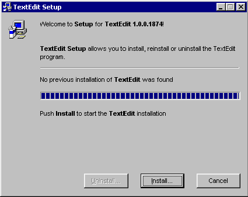
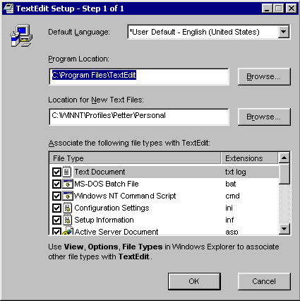
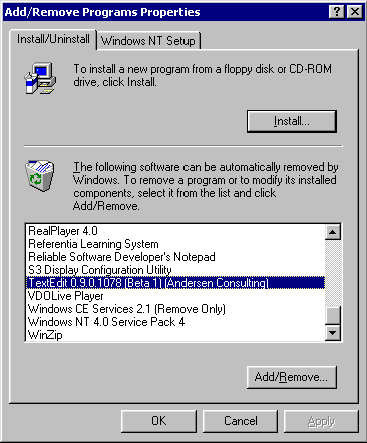

### Programming Industrial Strength Windows

[« Previous: Meanwhile, in the Background](Chapter-19-Meanwhile-in-the-Background.md) — [Next: The End of the Road »](Chapter-21-The-End-of-the-Road.md)

# Chapter&nbsp;20: Setup, and Down Again

Installation and setup of TextEdit is less of a chore than installation and setup of, say, Microsoft Office. TextEdit is distributed as a single file, rather than umpteen zillion. Still, a number of issues must be dealt with, including version control, registry entries, shortcuts to the application and how to uninstall cleanly.

There are many ways to install programs under Windows, including manual file copying, batch files, various Windows APIs and the Windows 98/Windows 2000 installer. There is also a large number of installation-creating products that help you automate the process.

The TextEdit installation is hand coded, mainly because I want to show you some of what’s happening behind the scenes.

In its installation incarnation, TextEdit looks like Figure&nbsp;39 when it starts.



**Figure&nbsp;39: TextEdit Setup in Action.** This is the standard TextEdit executable, started with the **/setup** switch.

Here are two ways to let TextEdit know that it should be an installer rather than a text editor:

* Start TextEdit with the /setup switch
* Rename the executable to setup.exe or install.exe

Installation leaves traces in the registry, under the key **`HKEY_LOCAL_MACHINE\Software\Andersen Consulting\TextEdit\InstallPath`**. TextEdit checks this registry key each time it starts. If nothing is there, it runs setup. If something is there, and TextEdit was started without arguments, it compares version numbers. If the running instance is newer than the installed instance, TextEdit asks the user whether an upgrade is in order. This is all handled by the isSetup function in init.cpp.

To start setup automatically on insertion of a CD, create a file named autorun.inf on the CD, with the following contents:

```ini
[autorun]
open=setup.exe
icon=setup.exe,5
```

The first thing the setup dialog does is check for a previous installation. If it finds one, it compares the version number of the installed file with that of the running executable. If the installed file is newer than the running executable, the m_isOlderThanPrevious member of SetupDlg is set to true, and the Cancel button of Figure&nbsp;39 is made the default button. If the user nevertheless clicks the Install button, a warning pops up.

## Installation

Invoking the Install button in Figure&nbsp;39 starts the installation. The first step is customization, handled by InstallDlg1, as shown in Figure&nbsp;40.



**Figure&nbsp;40: The Installation Dialog.** The check marks in the list are communicated back to SetupDlg through the FileType class.

The customization dialog lets you customize the installation by overriding the default values for data directory and program directory, and by selecting the file types that TextEdit should be associated with. It also lets you select the UI language (if you’re running under Windows NT); both the language and the data directory settings can be changed later through the Options dialog.

The FileType class handles everything related to file types. Each FileType instance describes one class of files, and the array FileType::sm_aFileType lists all file types we know about.

Three standard actions are usually associated with data files: Open (the default action), Edit and Print. These appear on the context menu when the data file is right-clicked in the explorer. Not all action/file type combinations are created equal, though. For a text document, Open means the same as Edit. For a batch file, Open means Execute. For an HTML document, Open means view it in a browser, and Edit probably means to edit it in a WYSIWYG HTML editor such as the Microsoft FrontPage editor.

For each document type, TextEdit knows whether Edit is the default action, whether Edit means “edit the source” and whether TextEdit should handle printing. In the cases where a program other than TextEdit is the natural choice for any of these actions, as is the case with HTML files, we simply add a new command to the context menu, “Edit with TextEdit.”

The FileType class has a member named m_bInclude; the user controls its value through the list box check marks in Figure&nbsp;40.

[FileType.h](../FileType.h)\
[FileType.cpp](../FileType.cpp)\
[InstallDlg1.cpp](../InstallDlg1.cpp)

## Copying Files

Once the customization dialog has been OK-ed, the setup dialog starts installThread, which in turn executes SetupDlg’s install member function, the true workhorse of the installation process. This method

* creates the application directory,
* copies the executable there,
* extracts the help files (see below),
* registers itself appropriately for all file types,
* creates shortcuts to the installed executable in the Programs section of the Start menu and in the user’s SendTo folder (see below)
* and, finally, stores the installation path in the registry.

The registerFileForDeletion function is the interface to a registry-based repository of names of files that should be deleted on uninstall. The file names are stored under the key

{{
HKEY_LOCAL_MACHINE\SOFTWARE\Andersen Consulting\TextEdit\Uninstall
}}

The uninstall process enumerates the values under this key and deletes the files.

## From Resources to Files

The TextEdit setup program is a single executable file, identical to the everyday TextEdit executable. From where, then, do we install the help files? The help files are embedded in the executable in the form of custom resources. In the resource script, we have the following two lines:

{{
IDR_CNT_FILE FILE DISCARDABLE "Help\\TextEdit.cnt"
IDR_HLP_FILE FILE DISCARDABLE "Help\\TextEdit.hlp"
}}

The copyResource function in SetupDlg.cpp uses the resource access API to copy a resource from the executable into a file. After you execute the following code, pData points to the first byte of TEXTEDIT.HLP:

```C++
HRSRC hrsrc = FindResource(
   0, MAKEINTRESOURCE( IDR_HLP_FILE ), _T( "FILE" ) );
HGLOBAL hRes = LoadResource( 0, hrsrc );
LPVOID pData = LockResource( hRes );
```

When you’re done with pData, the following code frees up the resource:

```C++
UnlockResource( hrsrc );
FreeResource( hrsrc );
```

…or does it? According to the documentation, UnlockResource is deprecated in Win32. Its definition bears this out – it’s a macro that simply evaluates its argument. A dummy, in other words.

According to the documentation, FreeResource is also obsolete. In this case, however, the header file (winbase.h) serves up a function prototype rather than a dummy macro, so the obsolescence is less obvious. The documentation goes on to say that, in the case of accelerator tables, bitmaps, cursors, icons and menus, you should call the corresponding destructor function (DestroyAcceleratorTable, DeleteObject, DestroyCursor, DestroyIcon and DestroyMenu) when you’re done with them.

If you’re supposed to free standard resources, why not custom resources? It seems likely that the documentation is wrong or incomplete on this point. Resource access is, in any case, badly documented, and I’ve found it difficult to get a clear picture of the design underlying the API.

## Shortcuts in the Shell

Creating shortcuts is a rather painful process involving two COM interfaces, IShellLink and IPersistFile. I’ve wrapped the whole thing in the addShortcut function in SetupDlg.cpp. The interface to this function is unsuited for a general addShortCut utility function, as it can only add shortcuts to one of the “special folder locations,” and the name of the shortcut is determined by the FileDescription entry in the file’s version resource.

## Uninstall

You uninstall TextEdit by starting it with the /setup switch. This invokes TextEdit in the general setup mode, which includes the uninstall function. It takes care of deleting the program file, deleting any directories created, cleaning up the registry, removing desktop shortcuts and removing start-menu shortcuts. I’ll get to the details as soon as we’ve given some thought to the user.

The user does not know about the /setup switch. How, then, does she invoke uninstall? One possibility is to provide a shortcut in the start menu or on the desktop. This approach has been used by many applications in the past, but is no longer recommended by Microsoft, and I agree. The start menu overfloweth as it is; no need to add more clutter.

The currently recommended approach is to use the Add/Remove Programs applet in the Control Panel (see Figure&nbsp;41). The title of this dialog is passing strange, by the way – why “Properties?” And, when the keyboard focus is in the list of removable software, why isn’t the Add/Remove button the default button?



**Figure&nbsp;41: The Add/Remove Programs Control Panel Applet.** Given that the keyboard focus is in the list, why isn’t the Add/Remove button the default? Eh?

Getting TextEdit into the list of removable programs is easy; we just have to add two entries to the registry, as follows:

Under the key

```
HKEY_LOCAL_MACHINE\SOFTWARE\Microsoft\
   Windows\CurrentVersion\Uninstall
```

we create a new key for our application. It happens to be named TextEdit, but it doesn’t really matter what it’s called, it just needs to be unique. The name displayed in the list in Figure&nbsp;41 is taken from one of the values under that key, named DisplayName. The other value is named UninstallString, and should contain the uninstall command: \<program-path\>\TextEdit.exe /setup.

Note that the Add/Remove button in Figure&nbsp;41 has an ellipsis after it, and that the text above the list includes “…remove a program or modify its installed components.” This means that uninstall may not barge ahead with its job; the least it must do is to ask the user if she really wants to do this potentially horrible thing. I once tried to modify the way a program was set up by clicking the Add/Remove button. The program softly and silently vanished away, and I got very upset. Believe me, you don’t want to put your users through such a painful ordeal.

Both the install function and its inverse, uninstall, can be found in SetupDlg.cpp.

[SetupDlg.cpp](../SetupDlg.cpp)

While setup does check the versions of the executables involved, it does no such things with the help files. This is because the help files embedded in the exe file are by definition the ones that belong to that version of the program.

## Mea Culpa…

In Chapter&nbsp;2, I told you that the best user interfaces are invisible. Anything that does not contribute towards the user’s goals is, therefore, suspect.

In truth, SetupDlg violates that principle. I admit it; I dragged in those animations because they are cool, not because they serve any essential purpose. If these operations really were time-consuming, it would be a different matter, but they’re not – I had to put in extra Sleep statements to give the user time to see the animations!

Under normal circumstances, I would have thrown out the extravaganzas. Given the time I spent fiddling with this, though, I felt it would be a shame to keep the results from my readers. If you need to do time-consuming stuff, this code may come in handy.
