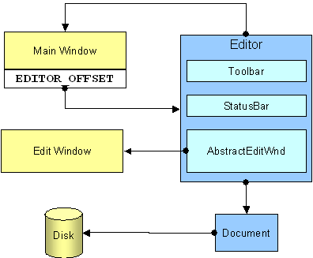

### Programming Industrial Strength Windows

[« Previous: The Mechanics of Subclassing](Chapter-4-The-Mechanics-of-Subclassing.md) — [Next: Exceptions »](Chapter-6-Exceptions.md)

# Chapter 5: The Bare Bones

This chapter gives you an overview of the TextEdit application architecture – the skeleton of the application, if you like. But first, this message from our sponsors:

“**Encapsulate what is likely to change.**”

This is an important object-oriented design principle. (Word’s grammar checker insist that a “design principle” ought to be a “design principal.” This illustrates another principal: If you try to pass your software off as “intelligent,” make sure it’s real smart, or it will appear to be real stupid.) (This, by the way, is nothing compared with what the spell checker of Word 2.0 did to me a few years ago: It insisted that “northwest” should be “northeast.” I don’t usually mind Word correcting my spelling, but I refuse to let it correct my geography!)

The temptation is great to encapsulate and generalize everything in sight, but this may be a bad idea. It takes longer to design and implement general, reusable classes than it does to create exactly what you need for your application. The interaction with a generalized class tends to be more complex, leading to more functional code, giving bugs more opportunity to creep in, making the code more difficult to follow and more complex to maintain. You do gain flexibility, but you may never use the bulk of it.

In TextEdit, the editing control is designed to be pluggable. Accordingly, it has a nice and clean interface, as defined by the abstract class **AbstractEditWindow**. Any interaction with the edit control should use that interface.

Such is theory. In practice, the abstract base class implements several of the operations, secure in the knowledge that the actual editing control is either an edit control or a rich edit control. This has the advantage of avoiding duplicate code in the **EditWnd** and **RichEditWnd** classes; it has the disadvantage that it may need changing the moment we introduce a control that doesn’t use, say, **`EN_CHANGE`** notifications.

To get notifications from an **AbstractEditWindow**, you must implement the **EditListener** interface. Among other things, the **EditListener** wraps the `EN_**` notifications, so that the listener won’t have to worry about such implementation details:

```C++
class EditListener {
public:
   virtual void onChange   ( void ) = 0;
   virtual void onMaxText  ( void ) = 0;
   virtual void onErrSpace ( void ) = 0;
   virtual void onPosChange( const Point& position ) = 0;
};
```

A truly general EditListener interface would have a reference to the AbstractEditWindow as a parameter in all the notifications. In TextEdit, the EditListener interface is implemented by the Editor object, which already knows about the only AbstractEditWindow in the application. This parameter is therefore unnecessary, and, being more concerned with overall simplicity than OO purity, I chose to skip it.

A truly general **AbstractEditWindow** class would allow registration of multiple **EditListeners**. If you are familiar with the Java Abstract Windowing Toolkit (AWT), this should ring a bell. At any rate, TextEdit doesn’t need this, so **AbstractEditWindow** does not provide it.

The **Toolbar** class, which wraps the toolbar, is an example of a more pragmatic approach. Whenever I need to do something to the toolbar that the Toolbar class interface doesn’t support, I either implement it directly in terms of the Windows API, or I extend the class interface, depending on how much coffee I’ve had lately. If I need to do something several places in the program, I’m more likely to change the class interface, but I won’t lose sleep over it either way. (The coffee is another matter.)

Furthermore, the Toolbar class contains TextEdit-specific code that makes it non-reusable as it stands. The “proper” thing to do would be to create a general Toolbar class and extend it with a TextEditToolbar class. That’s useful the moment I have more than one application with a toolbar, but as long as I don’t, it’s dead weight. One more class to think about, two more source files, and additional cogitation to determine how these classes should share their responsibilities? No thanks; not unless I get something in return.

## The Major Organs

The core of TextEdit consists of one window function and three C++ classes. There is a large supporting cast as well, but these are the stars:

* The main window function (mainWndProc in mainwnd.cpp), which is described in Chapter 9
* The Editor class, which lives in symbiosis with MainWndProc and is the nearest thing TextEdit has to a global application object
* The Document class, which handles disk files
* The AbstractEditWnd class, which wraps the editing widget.

The relationships between these are shown in Figure 5.



**Figure 5: Application Architecture Overview.**

The main entry point is defined in **WinMain.cpp**. The **WinMain** function does a small amount of initialization, then sets up the outermost try/catch block of the exception handling onion (a vegetable I shall get back to in the next chapter). Next, it calls the init function, whose job it is to interpret any arguments, possibly produce a Document object and an Editor object, and possibly to create the main window. (The init function is discussed in detail in Chapter 7.) Once the main window is up and running, control is transferred to TextEdit’s main message loop, buried in the **Editor:run** method.

[WinMain.cpp](../WinMain.cpp)

## The Heart

The heart of TextEdit – indeed, of any Windows application – is the message pump. TextEdit’s message pump resides in the Editor class – not for any deep philosophical reason, but because most of what might be termed “global application data” is contained within that class.

Here is a simplified version of **Editor::run**:

```C++
int Editor::run( HINSTANCE hinst ) {
   MSG msg = { 0, 0, static_cast< WPARAM >( -1 ) };

   BOOL bRun = true;
   while ( bRun ) {
      try {
         while ( bRun = GetMessage( &msg, 0, 0, 0 ) ) {
            if ( !TranslateAccelerator( m_hwnd, m_hacc, &msg ) &&
                 !isToolbarDialogMessage( &msg ) )
            {
               TranslateMessage( &msg );
               DispatchMessage ( &msg );
            }
         }
      }
      catch ( various exceptions ) {
         ...
      }
   }

   return msg.wParam;
}
```

Two things here are of particular interest. First, there is a double while loop, although one would be sufficient from a logical point of view. This is done to increase efficiency. Setting up a try block involves considerable overhead, so I want to avoid doing it for every message that’s pumped through the system. With a double loop, the try block is set up once when we start, then once for every exception that makes it this far.

Second, **TranslateAccelerator** is called before **isToolbarDialogMessage** (which wraps **IsDialogMessage**). This is to ensure that the accelerators work even when the focus is in one of the controls on the toolbar. If I switch the order, accelerators such as Ctrl+O (File Open) and Ctrl+F (Edit Find) don’t work whenever the focus is in the tab edit field or on the Read Only checkbox.

A side effect of this ordering is that the main window’s clipboard accelerators (Ctrl+C, Ctrl+X and Ctrl+V) take precedence over the tab edit field’s accelerators. If this were an issue, the various command handlers would have to check which window had the keyboard focus before applying their corresponding commands. The whole issue illustrates something that is not a design principle, but merely a sad fact of life: It can be difficult to get smooth interaction if every box is black.

## The Editor Class

Mapping all the parts of TextEdit to corresponding parts of the human body in a meaningful way is going to be difficult, so I’ll quit while I’m ahead.

The Editor class lives in close symbiosis with the main window function, and implements much of what the user perceives as commands in the TextEdit user interface. There’s openFile and printFile, save, restoreOriginal and searchAndSelect, and many more. The searchAndSelect function is a front-end to the actual searching machinery, implemented in AbstractEditWnd and its descendants. Searching is a surprisingly complex business; the Editor::searchAndSelect method, for example, is mainly concerned with the not-as-trivial-as-you-would-have-thought task of figuring out whether or not the file was wrapped while searching.

I’ll get back to search and replace in Chapter 15.

The Editor class also implements the EditListener interface, mentioned at the start of this chapter. This means that it receives notifications from the edit control, and is thus responsible for updating the line/column indicator on the status bar, for example.

You can find the declaration of the Editor class (as well as definitions of inline methods and functions) in Listing 16. The implementation is in Editor.cpp on the accompanying disk.

[Editor.h](../Editor.h)

## The Document Class

The Document class is in charge of disk files. It reads and writes files, it moves, copies and deletes files, it prints files (or parts of files) and it translates file contents to and from Unicode, and between MS-DOS-style and Unix-style line separators (CR-LF or just LF).

To facilitate the Abandon Changes command, we need to store the original contents of the file. This is also the responsibility of the Document class.

Chapter 10 explains how to create persistent variables using the registry. The Document class allows you to create persistent variables on a per-document basis.

I’ll return to the implementation of the Document class in Chapter 12.

[Document.h](../Document.h)

## The AbstractEditWnd Class

The AbstractEditWnd class defines the interface that all concrete edit window classes must implement. It also implements some of the functionality directly; particularly operations that can be defined purely in terms of other AbstractEditWnd operations – getLineCount, for example, which no-one bothers to override.

TextEdit includes two examples of concrete edit window classes: EditWnd, which uses the standard edit control, and RichEditWnd, which uses the rich edit control. The actual construction of one of these is done in the factory method AbstractEditWnd::create. It checks whether the module RICHED20.DLL can be loaded; if so, it creates a RichEditWnd. If not, its fallback strategy is to create an EditWnd. In a debug build, you can force TextEdit to create a standard edit control by using the /edit switch on the command line.

If you wish to use a different editing control, you must a) wrap it in a class derived from AbstractEditWnd and b) provide for its creation in AbstractEditWnd::create.

The rich edit control in ‘plain text mode’ is vastly superior to the standard edit control in most ways. It offers multi-level undo and redo, drag and drop editing and overall better behavior. Its most serious problem is that there is no good way to set the number of spaces to display for each tab stop – it does not understand the EM_SETTABSTOPS message, and the EM_SETPARAFORMAT message is geared towards word processing rather than plain text editing. I’ve found no satisfactory solution to this; as a result, the rich edit version doesn’t give you any control over how tabs are displayed. My only consolation is that Notepad doesn’t do this either.

[AbstractEditWnd.h](../AbstractEditWnd.h)

## Of Strings and PATHNAMEs

Let’s take a time-out here, to look at some common definitions and data types that are used throughout TextEdit. You need to know about these to follow the code that comes along presently. First, the String class, which has already been used without further explanation in previous examples.

### String

The String type is just my name for the std::string type from the Standard C++ Template Library (STL). It equates to a string or a wstring, depending on whether _UNICODE is defined. The String type is defined in String.h.

[String.h](../String.h)

### PATHNAME

A PATHNAME is a character array of length MAX_PATH. It is defined in common.h, as follows:

```C++
typedef WCHAR PATHNAMEW[ MAX_PATH + 1 ];
typedef CHAR  PATHNAMEA[ MAX_PATH + 1 ];

#ifdef UNICODE
   typedef PATHNAMEW PATHNAME;
#else
   typedef PATHNAMEA PATHNAME;
#endif
```

Whenever a PATHNAME (or any other string array) is declared, it is initialized thusly:

```C++
PATHNAME szTempPath = { 0 };
```

An alternative formulation would be this:

```C++
PATHNAME szTempPath = _T( "" );
```

The first formulation is preferable, as it is independent of Unicode and ANSI strings, and thus doesn’t require use of the _T macro. Zero is an accommodating constant; it adapts to lvalues of any size.

The PATHNAME type is an imperfect solution to the file name problem. If MAX_PATH changes, as well it might, we must recompile the application.

Beware of URLs, which are not subject to the MAX_PATH limit. The wininet.h header file defines the following (arbitrary) constants:

```C++
#define INTERNET_MAX_PATH_LENGTH   2048
#define INTERNET_MAX_SCHEME_LENGTH 32 // longest protocol name length
#define INTERNET_MAX_URL_LENGTH         (INTERNET_MAX_SCHEME_LENGTH \
                                        + sizeof("://") \
                                        + INTERNET_MAX_PATH_LENGTH)
```

### dim

The dim macro is defined in common.h, as follows:

```C++
#define dim( x ) (sizeof( x ) / sizeof( ( x )[ 0 ] ))
```

It is handy for figuring out the number of elements in an array. TextEdit uses this macro a lot with strings, as this is crucial for Unicode builds. For an ANSI build, the dim of a character array is equal to its sizeof; for a Unicode build, dim is half of its sizeof.

### PRIVATE

C and C++ use the static keyword for several different things. When a variable declaration is static at function or class scope, or a function declaration is static at class scope, it means that the variable is global (albeit with limited visibility), as opposed to being allocated on the stack or as part of a class instance. When a variable or function declaration is static at file scope, it means that the variable is private to the current compilation unit.

Since the semantics of these uses of static are unrelated, I’ve created the **PRIVATE** macro, which I use for the latter meaning. The **PRIVATE** macro is also defined in **common.h**.

[common.h](../common.h)
