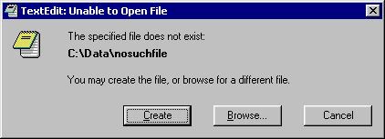

### Programming Industrial Strength Windows

[« Previous: Exceptions](Chapter-6-Exceptions.md) — [Next: Child Windows »](Chapter-8-Child-Windows.md)

# Chapter&nbsp;7: Off the Launch Pad

As with skinning a cat, there is more than one way to start a Win32 app­li­ca­t­ion. There are GUI ways and there are console ways; some of them have to do with shell integration, a con­cept that is also touched in [Chapter&nbsp;20, Setup](Chapter-20-Setup-and-Down-Again.md).

**Listing 24: Exploring the Command Line**

```C++
int WinMain( HINSTANCE, HINSTANCE, LPSTR pszCmdLine, int )
{
   MessageBox( 0, pszCmdLine, "Arguments", MB_OK );
}
```

This simple pro­g­ram proved helpful for ex­ploring the re­sults of various actions.
The starting of an app­li­ca­tion has two sides—the outside and the inside. This chap­ter is mostly concerned with the inside, in par­ti­cu­lar, all the possible values of the pszCmdLine parameter to WinMain. This is not as trivial as it sounds.

## Click, Drag and Drop

In the following, I assume that the GUI shell is the Windows Explorer. While other shells are certainly possible, they’d better deliver similar func­tion­ali­ty if they want to survive in the market place.

TextEdit can be started directly in several ways. After selecting the TextEdit icon, you can double-click, right-click and select Open from the context menu, or hit the Enter key. The re­sult is in any case that the shell calls CreateProcess, and eventually TextEdit’s WinMain is invoked.

The pszCmdLine parameter is now empty. In a situation like this, Notepad lets you edit an “untitled” file, one that exists in memory only. TextEdit, on the other hand, has a con­cep­tual model that supposedly works direct­ly on files—there is no con­cept of a separate memory image. Although this is an illusion, it means that untitled files are out—we must create a suitably named file in a suitable location. This is handled by the createNewFile func­tion in **createNewFile.cpp**.

A user’s default data directory can be retrieved using the **SHGetSpecialFolderLocation** func­tion with the **CSIDL_PERSONAL** parameter. On my machine, this defaults to **C:\WinNT\Profiles\myUserName\Personal**. Being inside the system directory, this doesn’t strike me as a particularly good place to store user data, so the TextEdit installation pro­g­ram allows users to select a dif­fe­rent default direc­tory. This location is maintained through the Options dia­log.

This changed in Windows 2000. If you wish to edit the file **sample.txt,** you can drag an icon representing the file onto the TextEdit icon. This time, **pszCmdLine** points to the full path of {{sample.txt,}} and TextEdit opens the file. Most sample pro­g­rams handle this straightforward case correctly.

You can also drag multiple files onto the TextEdit icon. This is where it starts getting moderately messy; the shell strings all the file names together with a space bet­ween them:

```cmd
c:\sample1.txt c:\sample2.txt
```


**Figure&nbsp;6: Notepad in Action.**

Parsing two consecutive file names as one doesn’t always work.
Now what? Since TextEdit is an SDI app­li­ca­tion, we can only open one file per in­stan­ce. Unless you want to get bizarre, the only answer is to start more TextEdit in­stan­ces. The primary in­stan­ce of TextEdit (the one invoked by the shell) parses the parameter list and takes the first file name for its own. Then it starts a new in­stan­ce of itself, passing the remaining file name parameters to the new in­stan­ce. This starts a cascade of recursive invocations that bot­toms out when the final in­stan­ce gets but one file name, poor thing.

Notepad treats the whole command line as a single file name, which may lead to the problem shown in Figure&nbsp;6.

The problem here appears to be the second colon, which makes the file name syntactically invalid. Try it from the command line, omitting the offending syntax:

```cmd
notepad sample1.txt sample2.txt
```


**Figure&nbsp;7: Notepad in Action again.**

Two consecutive file names constitute a valid file name, but the file does not exist.
This mes­sage box may not look too bright, but Notepad’s strategy actually turns out fine if you for­get to quote a file name containing spaces. TextEdit also tries this approach before considering each argument as a separate file name.

## Shell Integration

These are the direct ways you can start the app from a GUI shell; they work with all app­li­ca­tions and all data files. If the shell knows that TextEdit is associated with a specific file type (such as .txt), other possibilities open up.

You can open a text file by double-clicking its icon. The shell looks up the app­li­ca­tion association with .txt files (and if that app­li­ca­tion is still Notepad, you and I are no longer on speaking terms) and starts the pro­g­ram, passing the file name in pszCmdLine.

You can do this with multiple files, too. Select a bunch of files, and press Enter. From the user’s point of view, this is much the same as dragging one or more files onto the TextEdit icon. What happens behind the scenes is quite dif­fe­rent: instead of passing all the file names to a single TextEdit in­stan­ce, the shell starts one in­stan­ce of TextEdit for each file opened.

There’s another difference: If you drag text files onto the TextEdit icon, the file names sent to TextEdit are converted to the short 8.3 form, if necessary. If it didn’t, any file names with spaces would screw things up. The up side of this is that we don’t have to worry about spaces in the file names when parsing the command string. The down side is that we need to convert all file names to their long forms before displaying them to the user.

If you Open a bunch of text files, the file names sent to TextEdit are in their long form. Since long file names may contain spaces, each file name must be enclosed in double quotes. If not, TextEdit will assume that there are multiple file names on the command line. The shell does not put on the quotes for you; you have to specify this in the registry entries, e.g.:

```ini
[HKEY_CLASSES_ROOT\txtfile\shell\open\command]
@="\"C:\\Program Files\\TextEdit\\TextEdit.exe\" \"%1\""
```

Notepad’s registry entries neither have nor need the quotes, by the way, as Notepad inter­prets the command line as a single file name anyhow.

I shall describe the registry in more detail in later chapters.

The shell also supports printing. If the right entries are set in the registry, the shell displays a Print command on the context menu whenever you right-click sample.txt. The Print command starts TextEdit with the following **pszCmdLine:**

```cmd
/p "c:\sample.txt"
```

It is our responsibility to recognize the /p switch and to act appropriately.

Alternatively, you can drag sample.txt to a printer icon. This re­sults in a printto command, which is a little more complicated—it is taken as an order to use a specific printer, rather than the default printer. The printto command has the following gen­e­ral form:

```cmd
/pt <file_name> <printer_name> <driver_name> <port_name>
```

Here is a sample pszCmdLine:

```cmd
/pt "c:\sample.txt" "HP DeskJet 600" "RASD.DLL" "LPT1:"
```

If you use Shell integration to Print multiple files, the shell starts a new TextEdit in­stan­ce for each, so we need not worry about multiple /p or /pt switches.

Another shell integration con­cept is the **SendTo** folder. You don’t need to mess with the registry to use it; just create a short­cut to TextEdit.exe in the SendTo folder. This adds a “TextEdit” entry to the “Send To” submenu of the Explorer’s context menu. The re­sult of using the Send To command is the same as when you drag tiles onto the TextEdit icon, i.e., a single app­li­ca­tion in­stan­ce receives a string of one or more 8.3 file names separated by white space.

Windows NT maintains one SendTo folder per user.

## GUI Summary

To sum up, the GUI shell can give us the following command lines:

* Empty.
* One or more 8.3 file names separated by spaces
* A single long file name enclosed in double quotes
* The switch /p followed by a long file name enclosed in double quotes
* The switch /pt followed by a long file name enclosed in double quotes, a printer name, a printer driver name and a port name. The port name, by the way, is a relic from Win16, no longer used.

## The Console Connection

Let us leave the GUI shell for a while, and look instead at command line inter­pre­ters, or shells. The standard command shell for Windows 9x is command.com, while the one for Windows NT is cmd.exe. For our purposes, their behaviors are similar enough to ignore their differences.

You can start TextEdit by typing textedit at the command prompt. If you start a console pro­g­ram this way, the command shell waits patiently until the pro­g­ram has finished exe­cut­ing. A console pro­g­ram is marked /SUBSYSTEM:CONSOLE at link time. TextEdit, however, is marked /SUBSYSTEM:WINDOWS at link time, so the command shell returns to the prompt im­me­di­ately after calling CreateProcess.

As with the GUI shell, you can pass one or more file names as parameters to TextEdit. Any file names that contain spaces should be enclosed in quotes, but aside from that, you’re free to mix long and short, quoted and unquoted forms. The command line is total chaos com­pared with the GUI shell.

(This illustrates one of the great advantages of the GUI paradigm, namely the use of con­straints. Rather than typing a command, you must select it from a menu; rather than typing a file name, you are forced to select it from a list. Typos are no longer possible, and one source of errors is eliminated. The GUI con­straint paradigm also illustrates the best possible form of “error handling:” redesign the app­li­ca­tion so that the source of the error goes away.)

What happens if you type some­thing like “TextEdit *.txt”? That depends on the command processor you are using. UNIX command shells expand wildcards auto­mati­cal­ly, re­sulting in a command line of, say, “textedit sample1.txt sample2.txt.” Un­for­tu­nately, neither command.com nor cmd.exe do wildcard expansion, so TextEdit must deal with this on its own.

On the face of it, this would seem to require special treatment of arguments with wildcards, but this isn’t so. In the first place, if you treat sample.txt as a wildcard pat­tern and do a search using FindFileFirst and FindFileNext, you will find exactly one matching file, namely sample.txt. We can, in other words, treat all arguments as wildcard pat­terns without getting into trouble.

Even better, we can sidestep the whole issue by linking with **setargv.obj**, which gives us wildcard expansion for free. (Most compilers come with a similar relocat­able object file, though it might have another name, such as **wildargs.obj**.)

If no files match, the pro­g­ram is passed the exact parameter string as typed, i.e., **“**.txt”**.

If you try passing **\*.txt** to Notepad, it complains that it “cannot open the “*.txt” file.” This happens no matter how many files match the pat­tern. Notepad also tells you “to make sure that a disk is in the drive specified,” and the user is left wond­er­ing whether the pro­g­ram has suffered brain damage. Oxygen deprivation, per­haps. The least we can do is to recognize the alleged file name as a wildcard pat­tern, and report that no matching files were found.

What about long versus short file names? That doesn’t require any special treat­ment either. The func­tion GetLongPathName converts short names to long names, but if it is fed a long name, it will simply return that name. In other words: all file names—long and short—may safely be passed through GetLongPathName.

The one unfortunate thing about **GetLongPathName** is that it’s only available on Windows 98 and Windows 2000. Consequently, TextEdit has its own func­tion, cal­led **getLongPathName**, defined in **getLongPathName.cpp**:

**Listing 26: getLongPathName.cpp**

```C++
String getLongPathName( const String& strShort ) {

   String strLong;

   AutoComReference< IShellFolder > pShellFolder;
   HRESULT hres = SHGetDesktopFolder( &pShellFolder );
   if ( SUCCEEDED( hres ) ) {

#ifdef UNICODE
#define wszShort const_cast< LPWSTR >( strShort.c_str() )
#else
      PATHNAMEW wszShort = { 0 };
      multiByteToWideChar( strShort.c_str(), wszShort );
#endif

      ULONG ulEaten = 0;
      ULONG ulAttributes = 0;
      AutoShellObject< ITEMIDLIST > pidl;
      hres = pShellFolder->ParseDisplayName( HWND_DESKTOP, 0,
         wszShort, &ulEaten, &pidl, &ulAttributes );
      if ( SUCCEEDED( hres ) ) {
         strLong = getPathFromIDList( pidl );
      }
   }

   // In case of failure, keep the short name:
   if ( !SUCCEEDED( hres ) || strLong.empty() ) {
      strLong = strShort;
   }

   return strLong;
}
```

A dif­fe­rent, and possibly better, approach to the implementation of getLongPathName would have been to apply FindFirstFile to each path element in turn.

Wild cards require no special treatment, nor do long and short file names. This illustrates a design principle:

> “If possible, avoid special cases.”

Special cases require more code; in par­ti­cu­lar, they require branching. This makes testing that much harder and gives bugs additional opportunities to creep in. Bugs abound anyhow; why invite more?

Neverthe­less, one par­ti­cu­lar kind of file does require spe­cial treat­ment: the short­cut. Win32 “short­cuts” are not real links, merely files with a .lnk extension. The file system does not resolve short­cuts; the Explorer does. If you double-click a short­cut, the Explorer resolves it before handing you the file, so no special hand­ling is neces­sary. Not so the command-line shell; you’re fed the .lnk file, and that’s that.

This is all handled by the func­tion resolveName (see resolveName.cpp); its job is to figure out if the file is a link, and if so, to figure out which file the link references. All files pass through resolveName; the special handling is hidden on the inside. The in­side, by the way, uses the IShellLink COM in­ter­fa­ce to resolve the link.

Resolving links is an issue with the Open common dia­log as well. This dia­log is dis­cus­sed in Chapter&nbsp;14, [File Management](Chapter-14-File-Management.md).

Consider the following command line:

```cmd
C:\> textedit sample1.txt sample2.txt /p sample3.txt sample4.txt
```

Should we print all the files, or only the one im­me­di­ately following the /p switch, or all the files following the /p switch? Or should we disallow the whole command line on grounds of silliness?

Handling all possible variations in a reasonable way requires unreasonable con­tor­tions. TextEdit does allow the invocation, by printing all the files. Any other inter­pretation would be needlessly complex, both for the user and the pro­g­ram­mer.

## File Not Found



Figure&nbsp;8: TextEdit can’t find a file.

You may create a new file or browse for an existing file.
What if a file doesn’t exist? There are several ways to handle this, and Notepad is quite sensible about it—Notepad asks the user if it should create a new file by the given name. TextEdit extends this a bit: It explains that the file does not exist, and the user is presented with the following choices:

* Create the file as named
* Browse for an existing file, or just to get a dif­fe­rent name and location for a new file
* Exit TextEdit.
* If the file name contains wildcard characters, the pro­ce­du­re is slightly dif­fe­rent, as you can’t create a file with wildcard characters in the file name. TextEdit explains that no matching files where found, and goes on to explain what a wildcard character actually is.


**Figure&nbsp;9: No files match a wild­card pat­tern.**

Since some users will be unfamiliar with wildcards, the mes­sage box explains the con­cept. The explanation is not so intrusive as to bother power users.
From there, the choices are as above, except that creating the file as named is obviously out of the question.

Even if a file does exist, there are potential problems. The user may have limited access rights, or per­haps the file has been locked by a dif­fe­rent app­li­ca­tion. [Chapter&nbsp;12 (File I/O](Chapter-12-File-I-O.md)) deals with this.

## Read Only

A file can be read-only in many ways, some more permanent than others:

* The read-only file attribute is set
* The file resides on a CD-ROM
* The file resides on a write-protected floppy disk
* The user has no access, or read-only access. This can happen even on a Windows 9x system, if you’re connected to a network, or if another app­li­ca­tion has locked the file.

In other words, the file might be read-only, or the file’s location might be read-only. Or not even read…

## Other Anomalies

What happens if you double-click sample.txt while you are already editing the file with TextEdit? We have two possibilities—either we open the file in a second in­stan­ce of TextEdit, or we bring the first in­stan­ce to the top. Notepad takes the first route, which is a reasonable one for a traditional pro­g­ram. This paradigm has caused endless confusion and heartache among users that never realized they had five letters to grandma open at once. Besides, it fits badly (to put it mildly) with the unified file model, so TextEdit takes the second route. Before opening sample.txt, it checks whether the file is already open in a previous in­stan­ce of TextEdit. If so, that in­stan­ce is brought to the top, and the new in­stan­ce quietly terminates. This is handled by activateOldInstance (see activateOldInstance.cpp).

Conflicts and problems are still possible, of course—the file might be open in a dif­fe­rent pro­g­ram, or the user may rename or delete the file while we’re editing. The file may re­side on a removable volume that is removed, or on a network server that just crashed.

Multiple in­stan­ces of the same file on a command line don’t cause problems; this is handled auto­mati­cal­ly.

## Command-line Piping

Consider the following command line:

```cmd
C:\> dir | textedit
```

Wouldn’t it be nice if the output from the dir command were to appear in TextEdit? This was not a viable proposition under Win16, but it’s dead easy under Win32. The following call works even for GUI pro­g­rams:

```C++
HANDLE hIn = GetStdHandle( STD_INPUT_HANDLE );
```

To stay in character, TextEdit must of course create a file in which to keep the standard input. This is handled analogously to creating a new file, by the same func­tion, createNewFile (createNewFile.cpp).

Mixing file name parameters with piping works just fine; the following will edit both sample.txt and the output from the dir command, in two separate in­stan­ces of TextEdit:

```cmd
C:\> dir | textedit sample.txt
```

If you wish to print a file from the command line, this is one convoluted way of doing it:

```cmd
C:\> type sample.txt | textedit /p
```

Command-line pipes are only for experts such as thee and me—a beginner won’t even realize the capability is there. Power users will love it, though, and don’t for­get that beginners and intermediates rely on experts for advice on what software to buy. Cater to your power users!

## Drag and Drop Revisited

So far, we’ve talked of dragging one or more text file icons onto the TextEdit icon. You can also drag a text file icon onto a running in­stan­ce of TextEdit. TextEdit identifies itself as capable of handling the WM_DROPFILES mes­sage by calling DragAcceptFiles during main win­dow creation, so the Explorer will happily send us a WM_DROPFILES mes­sage. In response, TextEdit will open the dropped file in place of the current file.

What should we do if somebody drops multiple files on us? That is actually a some­what thorny problem. For an MDI app­li­ca­tion, it is per­fectly natural to open multiple files, but for an SDI app­li­ca­tion, this would be a distinctly unnatural act.

Notepad ignores all the files but one, which is certainly a reasonable design deci­sion. Another possibility would be to string all the files together into a composite. This is per­haps the most “natural” action possible for an SDI app­li­ca­tion, but really too bizarre for serious consideration.

What TextEdit actually does is open one of the files in the existing win­dow, and start new in­stan­ces for all the others. This is a conceptually imperfect solution, but it’s the best I can think of.

Handling the **WM_DROPFILES** mes­sage involves two func­tions: **DragQueryFile** and **DragFinish**. The handler can be found in mainwnd.cpp, and it looks like this:

```C++
LOCAL void onDropFiles( HWND hwnd, HDROP hdrop ) {
   const UINT DRAGQUERY_NUMFILES = (UINT) -1;
   const int nFiles = DragQueryFile( hdrop, DRAGQUERY_NUMFILES, 0, 0 );
   for ( int iFile = nFiles—1; 0 <= iFile; --iFile ) {
      PATHNAME szDragFile = { 0 };
      verify( 0 < DragQueryFile( hdrop, iFile, szDragFile, dim( szDragFile ) ) );
      if ( 0 == iFile ) {
         getEditor( hwnd )->openFile( szDragFile );
      } else {
         startInstance( szDragFile, SW_SHOW );
      }
   }
   DragFinish( hdrop );
}
```

If the **DragQueryFile** func­tion is invoked with the second parameter equal to **-1**, the func­tion just returns the number of files dropped; otherwise, the second parameter is an index.

## Additional Switches

TextEdit understands several other switches. Some, such as /min and /max, are con­ven­iences, while others, such as /setup, allows the single executable to func­tion in several com­pletely dif­fe­rent ways. The complete list of command-line switches is summarized in the following table:

| Option | Explanation |
|--------|-------------|
| /boot | Checks the registry for files marked “running,” and starts a TextEdit in­stan­ce for each. |
| /edit | Forces use of the standard edit widget rather than the rich edit widget. This switch is only available in debug builds. |
| /last | Opens previous file (MRU 1). |
| /min | Start TextEdit minimized. |
| /max | Start TextEdit maximized. |
| /p /print | Print, showing the print dia­log. |
| /pt /printto | Print to a specific printer, don’t show the print dia­log. |
| /setup | Start the TextEdit installation and maintenance subsystem. A TextEdit installation disk should include either Setup.exe.lnk (a short­cut to “TextEdit.exe /setup”) or a TextEdit executable renamed to setup.exe or install.exe. |

Should we allow the hyphen to signal command-line switches? The hyphen, or minus sign, is the standard option signal on Unix, and many DOS and Windows pro­g­rams accept it in ad­di­tion to the slash. There is only one hitch—it is per­fectly le­g­itimate to start a file name with a hyphen.

No conflict arises when TextEdit is started from the GUI shell. Any hyphens are certain to be somewhere inside the path name, and so won’t be recognized as the start of a switch. From the command line, however, it is necessary to say some­thing like `textedit .\-myFile.txt` rather than `textedit -myFile.txt`. Otherwise, TextEdit gets confused by the `myFile` switch, which it has never heard of.

To confuse things further, the slash is a per­fectly good separator of path ele­ments. It’s only the internal commands in COMMAND.COM and CMD.EXE that think otherwise; the file system is happy with slashes going either way.

In TextEdit, both the slash and the hyphen signal a switch, but all unrecognized switches are assumed to be file names. In init.cpp, you will find some vestigial code that warns against unrecognized options. I removed that code after writing the above couple of para­graphs, and TextEdit will now happily accept both /myDirectory/-myFile and -myFile as arguments.

This confusion has two drawbacks. A misspelled switch is treated as a file name, and files with option names need some path decoration on the command line (e.g., the file `-max` must be specified as `.\-max` or `./-max`). Even more confusing, spe­ci­fy­ing `textedit *` in a directory that only contains the file `-max`, will re­sult in the editing of a new file in a maximized win­dow, hardly what was intended. (Spe­ci­fy­ing `textedit .⁄*` works, though.)

We live in an imperfect world, and can only do the best we can. These drawbacks are not serious enough to lose sleep over.

## Accessing the Command Line

I’ve talked a lot about pszCmdLine in this chapter, but we don’t actually use it. We could, but we would then have to parse it, some­thing the C Runtime Library (CRT) is per­fectly ca­pable of doing for us.

The main func­tion of a console app­li­ca­tion gets its parameters in predigested form, with argc giving the number of arguments, and argv giving the arguments them­selves. This parameter parsing does more than just find all the white space; it also handles quoted arguments correctly. It turns out that argc and argv are accessible from /SUBSYSTEM:WINDOWS pro­g­rams, too, through the global CRT variables __argc and __argv.

The ArgumentList class is in charge of command lines. In ad­di­tion to wrapping access to __argc and __argv, it handles the command line switches (options).

[ArgumentList.h](../ArgumentList.h)\
[ArgumentList.cpp](../ArgumentList.cpp)\
[init.cpp](../init.cpp)
