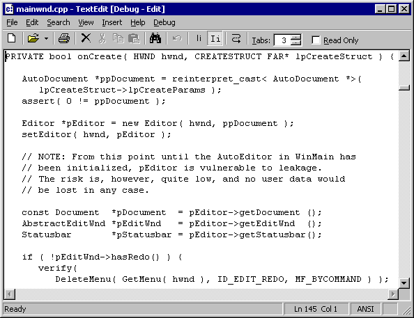

### Programming Industrial Strength Windows

[« Previous: Off the Launch Pad](Chapter-7-Off-the-Launch-Pad.md) — [Next: The Main Window »](Chapter-9-The-Main-Window.md)

# Chapter 8: Child Windows

The TextEdit main windows is a standard SDI (Single Document Interface) application window with optional tool– and status bars, and a big, fat text editing window in the middle.



**Figure 10: TextEdit in Action, with eight of its nine windows visible.**

How many windows do you count in Figure 10? There are nine of them, eight of which are arranged in the following hierarchy:

```
The main application window
   The toolbar
      The “Tabs:” static label
      The editing field for number of spaces per tab
      The up/down control for the editing field
      The “Read Only” check box
   The editing window
   The status bar
```

The ninth window is the toolbar’s ToolTip window, which was not present when the picture in Figure 10 was taken. The individual bitmaps on the toolbar are not windows; neither are the panes on the status bar. The scroll bars are part of the non-client area of the editing window. If this were OS/2 presentation manager, the scroll bars would be windows in their own right. Since this is Windows, they are not.

TextEdit has more windows than these, though. Dialog boxes and their controls are windows too, and I’ll have more to say about them later, starting in [Chapter 13](Chapter-13-About-Dialogs.md).

## Window Creation

The main window is created in the init function in init.cpp. The main window’s `WM_CREATE` handler, onCreate, is responsible for creating the Editor object, which in turn creates the toolbar and the status bar. I shall have more to say about the main window in the next chapter, and I talked about the AbstractEditWndProc in the previous chapter. For now, let’s concentrate on the tool bar and the status bar.

## The Tool Bar

The tool bar is a window of class ToolbarWindow32, implemented in COMCTL32.DLL and wrapped by the Toolbar class, a subclass of Window . The toolbar has four children if we’re using an edit control, only one if we’re using a rich edit control.

The toolbar is somewhat dynamic; it may change during a TextEdit session. This may happen if the user changes the desktop settings, or if the user changes the language (via the Options dialog box). Changing toolbar metrics on the fly turns out to be difficult, so the Editor class handles this by creating a new toolbar from scratch in its refreshToolbar method:

```C++
void Editor::refreshToolbar( void ) {
   assert( isGoodPtr( this ) );
   assert( isGoodPtr( m_pEditWnd ) );
   m_pToolbar.reset( new Toolbar( this, IDC_TOOLBAR, m_pEditWnd->hasRedo(), m_pEditWnd->canSetTabs() ) );
}
```

In other words, the old toolbar is deleted, and a new toolbar is created in its place.

The tool bar’s tool tips come in two different flavors. We get tool tips for the buttons just by adding the `TBSTYLE_TOOLTIPS` style bit, but tool tips for the child controls must be added the hard way – control by control. The Toolbar constructor sends itself a `TB_GETTOOLTIPS` message to get hold of the tool tip window, then sends the tool tip a `TTM_ADDTOOL` message for each child:

```C++
HWND hwndToolTip =
   reinterpret_cast< HWND >( sendMessage( TB_GETTOOLTIPS ) );
if ( IsWindow( hwndToolTip ) ) {
   TOOLINFO toolInfo = {
      sizeof( TOOLINFO ),
      TTF_CENTERTIP | TTF_IDISHWND | TTF_SUBCLASS | TTF_TRANSPARENT,
      *this, reinterpret_cast< UINT >( hwndReadOnly ), { 0 },
      hinst, LPSTR_TEXTCALLBACK,
   };
   SNDMSG( hwndToolTip, TTM_ADDTOOL, 0, reinterpret_cast< WPARAM >( &toolInfo ) );
   if ( canSetTabs ) {
      toolInfo.uId = reinterpret_cast< UINT >( hwndTabs );
      SNDMSG( hwndToolTip, TTM_ADDTOOL, 0, reinterpret_cast< WPARAM >( &toolInfo ) );
      toolInfo.uId = reinterpret_cast< UINT >( hwndUpDown );
      SNDMSG( hwndToolTip, TTM_ADDTOOL, 0, reinterpret_cast< WPARAM >( &toolInfo ) );
   }
}
```

The onGetDispInfo method handles the `TTN_GETDISPINFO` notification, which the tool tip sends to get the text to display. The child windows require a separate test for each, while the buttons are handled in a generic manner. The loadToolTip function (in utils.cpp) is a simple wrapper around loadString (also in utils.cpp). If the string contains a carriage return, everything up to and including the CR is deleted. (Everything in front of the CR is used to display the menu help text in the status bar.)

The **Toolbar** module defines two instance subclassings:

* The edit control (containing the number of spaces per tab) is subclassed to pass page up and page down keys through to the edit window, to change the return value from the `WM_GETDLGCODE` message and to set and reset the status bar prompt in response to the `WM_SETFOCUS` and `WM_KILLFOCUS` messages.
* The parent window is subclassed to intercept `WM_SIZE` and `WM_NOTIFY` messages. This could have been handled in the main window, of course, but by doing it this way, all code pertinent to the toolbar is kept in one class.

The final item of interest is the adjust method, which calculates the position of the child windows. Like all such calculations, it is rather hairy, and also rather boring. Note that the final item in the toolbar’s TBBUTTON array is a separator with the identifier `ID_TABPLACEHOLDER`; it exists only so that we can figure out where the buttons end.

< Listing 32: Toolbar.h>
< Listing 33: Toolbar.cpp>

## The Status Bar

The status bar is a window of class `msctls_statusbar32`, implemented in COMCTL32.DLL and wrapped by the StatusBar class, a subclass of the Window class. The status bar has no children; instead, it has four panes, identified by the enumeration Statusbar::StatusBarParts:

```C++
enum StatusBarParts {
   message_part ,
   position_part,
   filetype_part,
   action_part  ,
};
```

(There are situations where status bars do have children; a typical example is the display of a progress bar during a lengthy operation.)

Most of the **Statusbar** class is devoted to providing convenient ways of setting texts and icons in the various panes.

Like the tool bar, the status bar subclasses the main window to intercept messages. The status bar is interested in `WM_SIZE` and `WM_DRAWITEM`. (Subclassing a window to listen in on the message traffic is different from MFC’s message reflection mechanism, but the result is similar – improved encapsulation.)

The first pane is **`SBT_OWNERDRAW`**, because I want to display rich text in the pane, and because I want to highlight some messages. The **paintHTML** function (in HTML.cpp) handles both; I’ll get back to the details in [Chapter 13](Chapter-13-About-Dialogs.md).

The final item of interest is the recalcParts method, which (re-) calculates the sizes of the status bar panes in response to size changes in the main window. This is necessary because the first pane is the one that stretches.

< Listing 34: Statusbar.h>
< Listing 35: Statusbar.cpp>
