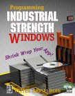

### Project Description

TextEdit is a text editor, written in {"C++"} to the raw Win32 API. It illustrates how to fit together all the myriad bits and pieces that make a robust Windows application a, well, robust Windows application.

It was originally written as the companion program to my book Programming Industrial Strength Windows (2000); I've occasionally fiddled with it in the years since then. Now that it has a home on CodePlex I'll probably continue fiddling, even though my everyday focus has moved to .NET: Technology changes more easily than design principles. And it sure beats NotePad.

TextEdit demonstrates a number of things:

* There is no _Save_ command. TextEdit follows Allan Cooper's unified file model, where all changes are committed directly to disk.
* Error handling and robustness.
* [Persistence everywhere](Chapter-10-Customization-and-Persistence).
* Send as email.
* [Installation and registration](Chapter-20-Setup-and-Down-Again) (under the hood, as it were).
* Utilizing the SendTo folder.
* [The myriad ways of starting a Windows app and receiving arguments](Chapter-7-Off-the-Launch-Pad).
* [The fine points of dialogs](Chapter-13-About-Dialogs)
* [Simple HTML parsing and rendering](Sidebar_-The-HTML-Static-Control).
* Snap window to edges of work area during move and resize

[release:Go to download page](16713)

### Documentation

I'm posting an entire book here, in the hope that this will provide sufficient documentation, and perhaps some additional value:

[Programming Industrial Strength Windows](Programming-Industrial-Strength-Windows)

The logo, by the way, was made with [Microsoft Expression Design 2.](http://www.microsoft.com/expression/products/Overview.aspx?key=design)
[Further info about me.](http://petterhesselberg.com/)